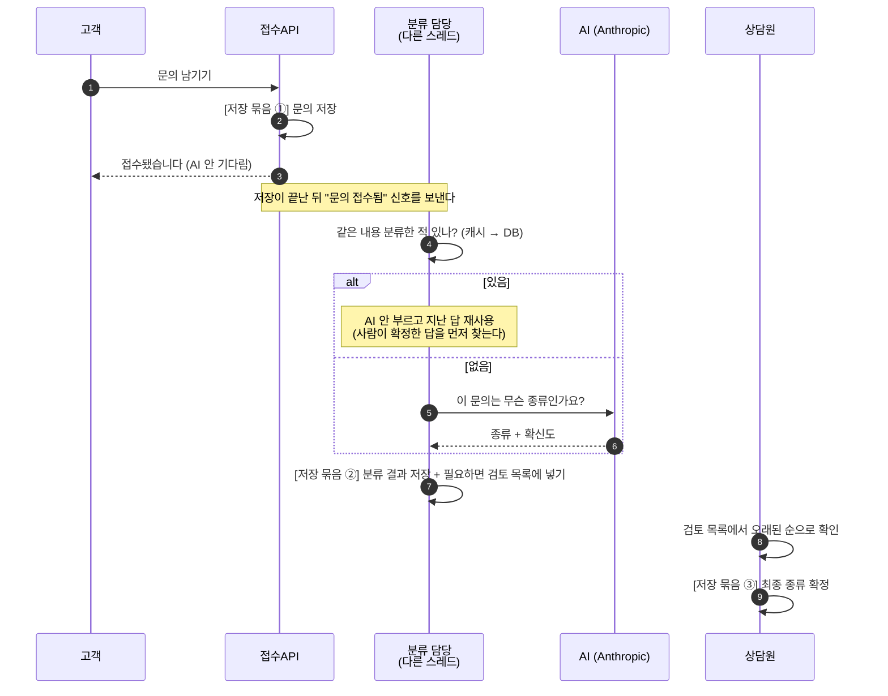
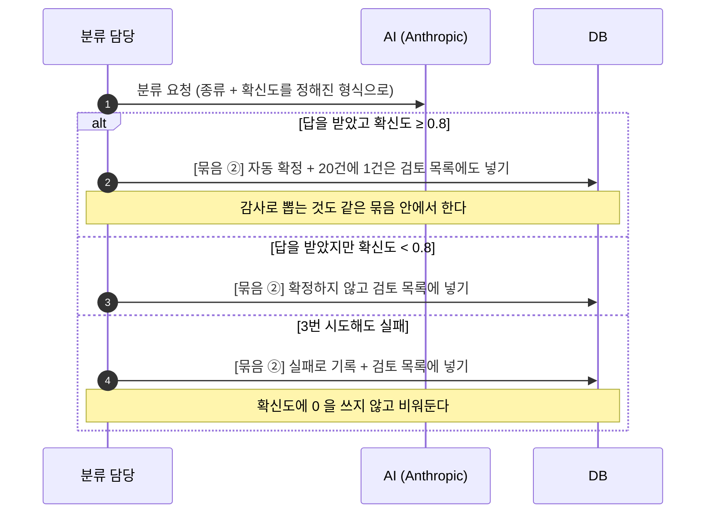
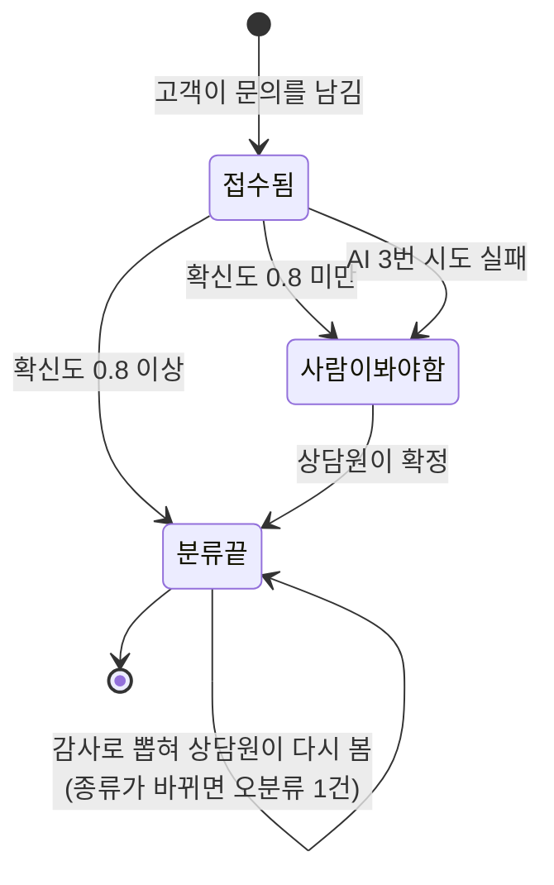

# PRD — AI 문의 분류 검증 파이프라인

> 기획 단계 산출물. 왜 그렇게 정했는지는 `DECISIONS.md`, API 규격은 `API-CONTRACT.md`, 코딩 규칙은 `CLAUDE.md`.
> 모르는 단어는 [`GLOSSARY.md`](./GLOSSARY.md).

## 1. 한 줄 소개

고객이 남긴 문의를 AI가 자동으로 분류하되, **AI가 확신하지 못한 건은 사람에게 넘기고, 확신한 건도 일부를 몰래 뽑아 사람이 다시 본다.**

두 번째가 이 프로젝트의 핵심이다. AI는 틀렸으면서 확신하는 경우가 있는데, 그런 건 "확신도가 낮으면 사람에게"라는 규칙만으로는 절대 못 잡는다. 그래서 자동으로 통과한 것 중 20건에 1건을 뽑아 사람이 다시 확인하고, **AI 답과 사람 답이 다른 비율을 숫자로 낸다.**

## 1-1. 한 장 요약 (PAAR)

> **팀 밖에 보여줄 한 장 요약은 [`PROJECT-BRIEF.md`](./PROJECT-BRIEF.md) 에 따로 있다** (발표·이력서용). 그 문서는 이 문서에서 파생되므로, **새로 정한 것은 항상 여기에 먼저 쓴다** (D-050).
>
> 이 절은 **문제 → 대안 비교 → 무엇을 골랐나 → 무엇을 재서 증명하나** 를 한 장에 담은 것이다.
> 아래 §2~§12는 이 네 칸을 자세히 푼 것이고, 각 결정의 전체 근거는 `DECISIONS.md` 에 있다.
> 번호를 `1-1` 로 단 이유는 뒤 절의 번호를 밀지 않기 위해서다 — 다른 문서가 `PRD.md §7` 같은 참조를 쓰고 있다.

### P — 무엇이 문제인가

AI에게 문의를 분류시키면 답은 준다. 그런데 **그 답이 맞는지 아무도 확인하지 않는다.**

문제는 두 겹이다.

1. **AI가 자신 없어 하는 답이 그대로 저장된다** — 틀린 분류가 운영 데이터가 된다
2. **AI가 확신하면서 틀린다** — 이건 1번을 아무리 잘 막아도 안 걸린다. 확신도가 높으니까

2번이 이 프로젝트가 붙잡은 문제다. AI가 스스로 매긴 확신도는 **시험 본 사람이 자기 점수를 매기는 것**과 같아서, 그 값이 맞는다는 보장이 어디에도 없다.

### A — 어떤 대안이 있었나

| | 방식 | 1번을 막나 | 2번을 막나 | 대가 |
| --- | --- | --- | --- | --- |
| A | AI 답을 무조건 저장 | ❌ | ❌ | 없음 (가장 단순) |
| B | 확신도가 낮으면 그냥 버림 | △ 저장은 막음 | ❌ | 버린 문의가 사라짐 |
| C | 확신도가 낮으면 사람 검토 목록으로 | ✅ | ❌ | 큐 + 확정 API + 트랜잭션 설계 |
| **D** | **C + 자동 확정된 것 중 5%를 몰래 뽑아 사람이 다시 봄** | ✅ | **✅** | C 전부 + 감사 샘플링 + 가리기(blind) 설계 |

**판단 기준 4가지**

1. 틀린 분류가 운영 데이터에 그대로 남지 않는가
2. **AI가 확신하면서 틀린 비율을 숫자로 낼 수 있는가** ← A·B·C는 전부 여기서 탈락한다
3. 밀린 검토 건수를 눈으로 볼 수 있는가
4. AI 호출이 실패해도 문의가 조용히 사라지지 않는가

### A — 무엇을 골랐나

**옵션 D를 채택했다** (`DECISIONS.md` D-005). 구체적으로 정한 것은 6가지다.

| | 정한 것 | 왜 |
| --- | --- | --- |
| 1 | 확신도 기준값 **하나**(0.8)로 자동 확정 / 검토 목록을 가른다 | 종류마다 다르게 하면 측정 결과를 해석할 수 없다 (D-006 폐기) |
| 2 | **자동 확정 건의 5% + 재사용 확정 건의 5%** 를 무작위로 뽑아 검토 목록에 넣는다 | 이게 2번 문제를 잡는 유일한 장치 (D-005, D-033) |
| 3 | 검토 목록 응답에서 **사유·확신도·기준값을 모두 가린다** | 감사인 걸 알면 평소보다 신중해져서 결과가 좋게 나온다 (D-010) |
| 4 | 문의 저장(①)과 분류 결과 저장(②)을 **다른 트랜잭션**으로 둔다 | ②가 실패해도 고객이 받은 접수 확인이 거짓말이 되면 안 된다 (D-031) |
| 5 | AI 응답이 깨지거나 값이 이상하면 **확신도를 비워두고** 실패로 남긴다 | 0이나 1.0을 채워 넣으면 측정 8ⓐ의 구간별 집계가 오염된다 (D-022, D-034) |
| 6 | AI 호출은 **다른 스레드**에서 하고 3번까지 재시도, 소진하면 검토 목록으로 | 고객을 몇 초 기다리게 하지 않으면서 문의를 잃지도 않는다 |

**옵션 C가 아니라 D여야 하는 이유를 한 문장으로**: C까지만 만들면 "AI가 확신하면서 틀린 비율"을 물었을 때 **모른다고 답해야 한다.** 그 숫자가 이 프로젝트의 결과물이다.

### R — 무엇을 재서 증명하나

**결론에 해당하는 세 숫자가 나왔다 (2026-08-13).** 재는 방법과 조건은 §9, 한계는 각 evidence 문서에 있다.

| 무엇 | 나온 값 | 어떻게 읽나 |
| --- | --- | --- |
| **8ⓐ-1 · 자동 확정 건의 실제 오분류율** (확신도 구간별) | **0.094** — 32건 중 3건, 그중 하나는 확신도 **0.95** | 0이 아니므로 **옵션 C로는 못 잡는 실패가 실재한다**는 증거다 |
| **8ⓐ-2 · 5% 감사가 그중 몇 건을 집어냈나** | **0.333** — 3건 중 1건, **2건은 놓쳤다** | 8ⓐ-1과의 차이가 곧 **5% 샘플링의 검출 한계**다. 한계를 아는 것까지가 설계다 |
| **12 · 상담원 2명의 분류가 얼마나 일치하나** | **90.0%** (모집단 50건) | 8ⓐ의 오분류율 중 "사람끼리도 갈리는 몫"을 떼어내는 값 |

**세 숫자를 못 내면 이 프로젝트는 옵션 C를 만든 것과 구분되지 않는다.** 그래서 코드 구현 순서도 이 세 숫자에서 거꾸로 따라가 정했다 — §8 참조.

> ⚠️ **숫자만 옮겨 인용하지 않는다.** 8ⓐ-2 의 0.333 은 **감사가 설정보다 3배 뽑힌 회차의 값**이라 낙관 편향돼 있고, 8ⓐ-1 의 3건 중 2건은 **사람도 AI와 똑같이 봤고 §7 경계표만 다르게 말한** 건이다. 조건과 한계는 `evidence/measurement-1-8a.md` 에 함께 있다.

## 2. 쓰는 사람 3명

| 사람 | 할 수 있는 일 | 못 하는 일 |
| --- | --- | --- |
| 고객 | 문의 남기기, 자기 문의 보기 | 남의 문의·검토 목록·통계 보기 |
| 상담원 | 검토 목록 보기, 최종 분류 확정하기 | 통계 보기 |
| 운영 매니저 | 위 전부 + 전체 통계 보기 | 설정 변경 (이번 범위에서는 불가) |

**셋을 나눈 이유**: 문의를 남기는 사람이 분류까지 확정하면 검증이 성립하지 않는다. 고객 계정이 털려도 검토 목록과 통계는 안 보이게 막는다.

## 3. 핵심 흐름

```text
① 고객이 문의를 남긴다
       ↓  (AI를 기다리지 않고 바로 "접수됐습니다" 응답)
② 뒤에서 AI가 분류한다 — "환불 문의 같고, 확신도 0.85"
       ↓
③ 확신도를 기준값(0.8)과 비교한다
       ├─ 0.8 이상 → 자동 확정
       │      └─ 이 중 20건에 1건은 몰래 뽑아 검토 목록에 넣는다   ← 감사
       └─ 0.8 미만 → 확정하지 않고 검토 목록에 넣는다
       ↓
④ 상담원이 검토 목록을 열어 최종 분류를 확정한다
       ↓
⑤ AI 답과 사람 답이 다르면 오분류 1건으로 센다
```

AI 호출이 실패하면 3번까지 다시 시도하고, 그래도 안 되면 검토 목록에 넣는다. **조용히 사라지는 문의가 없게 하는 것**이 이 흐름의 목표다.

같은 흐름을 시간 순서로 그리면 이렇다. 점선이 응답이고, `[저장 묶음]`은 한 덩어리로 저장되는 구간이다.



## 4. 사용자 이야기

US-1~9는 팀이 합의한 번호 그대로다. 10~13은 설계하면서 추가했다.

| 번호 | 내용 |
| --- | --- |
| US-1 | 고객은 분류를 기다리지 않고 바로 접수 확인을 받는다 |
| US-2 | 시스템은 접수 후 뒤에서 AI를 불러 분류와 확신도를 받는다 |
| US-3 | AI 호출이 실패하면 3번까지 다시 시도하고, 그래도 안 되면 검토 목록에 넣는다 |
| US-4 | 확신도가 기준값 이상이면 자동으로 확정한다 |
| US-5 | 확신도가 기준값 미만이면 확정하지 않고 검토 목록에 넣는다 |
| US-6 | 상담원은 검토할 문의를 오래된 순으로 본다 |
| US-7 | 상담원은 검토 목록에서 최종 분류를 확정한다 |
| US-8 | 운영 매니저는 분류 성공률과 밀린 검토 건수를 본다 |
| US-9 | 개발자는 분류 저장은 됐는데 검토 목록 넣기가 실패했을 때, **문의 원문은 남아 있는지** 확인한다 |
| US-10 | 시스템은 자동 확정된 문의 중 5%를 뽑아 검토 목록에 넣는다 (감사) |
| US-11 | 상담원이 이미 확정된 항목을 또 확정하려 하면 409로 막는다 |
| US-12 | 같은 내용의 문의가 또 오면 AI를 다시 부르지 않는다 |
| US-13 | 고객이 검토 목록이나 통계에 접근하면 403으로 막는다 |

> **US-9는 팀 원안을 뒤집었다.** 원안은 "문의 원문 저장까지 되돌아가는지 확인"이었는데, US-2에서 접수와 분류를 이미 분리했으므로 접수는 그 시점에 저장이 끝나 있다. 원안대로 되돌리면 **고객이 이미 받은 접수 확인이 거짓말이 된다.** 그래서 "분류 결과는 되돌아가고 문의 원문은 남는지"를 확인하는 것으로 바꿨다 (D-031).

## 5. 만들 기능 6가지

### 5-0. 여섯 기능이 코드 어디에 붙나

아래 5-1~5-6은 **왜 그렇게 만드는가**를 설명한다. 이 표는 **무엇으로 어디에 만드는가**를 한 장에 모은 것이다. 파일 이름은 `CLAUDE.md` 「6 공통 필수 기능 매핑」과 같다.

| 기능 | 무엇으로 만드나 | 어디에 | 어떻게 확인하나 |
| --- | --- | --- | --- |
| 권한·역할 | Spring Security. 로그인 대신 **요청 헤더**(`X-User-Id`, `X-User-Role`)로 역할을 받아 `SecurityContext` 에 넣는 필터 1개 + 메서드 권한(`@PreAuthorize`) | `config/SecurityConfig` | 고객 역할로 검토 목록 호출 → 403 (US-13) |
| 핵심 트랜잭션 | `@Transactional` **세 곳뿐**. 저장 뒤 신호는 `@TransactionalEventListener(AFTER_COMMIT)` | ① `service/InquiryIngestService.receive`<br>② `service/ClassificationService.verifyAndPersist`<br>③ `service/ReviewService.confirm` | 큐 삽입을 일부러 실패 → 분류 결과만 되돌아감 (측정 3) |
| 검색·필터 | 조건부 조회 + 페이징. 항목마다 추가 쿼리가 안 나가게 `@EntityGraph` | `domain/repository/InquiryReviewQueueRepository.search` | `EXPLAIN` 전후 비교 (측정 5), 쿼리 개수 세기 (속도 b) |
| 캐시 | Redis. **1단은 직접 넣고 빼고**(조건부라 `@Cacheable` 로 안 됨), 통계 요약만 `@Cacheable` + `@CacheEvict` | ① `service/ClassificationCache`<br>② `service/StatsService.summary` | AI 호출 횟수 (측정 6), 캐시 적중률 (측정 11) |
| 비동기·이벤트 | `@Async` + 스레드풀 직접 지정, `@Retryable(3)` + `@Recover` | `service/event/InquiryReceivedEventListener`, `service/event/` | 오류 주입 → 재시도 3회 + 큐 삽입 (측정 4) |
| AI 보조 | Anthropic 호출 + 값 검증 4가지 + 기준값 비교 + 감사 5% 뽑기 | `service/ai/` (호출·값 검증), `service/AuditSamplingPolicy` | 정답 대조 (측정 1), 오분류율 (측정 8ⓐ-1) |

**시작 전에 넣어야 할 것 2개** — 지금 `build.gradle` 에 없어서, 없는 채로 코드를 쓰면 컴파일부터 막힌다.

| 무엇 | 왜 없었나 |
| --- | --- |
| `spring-boot-starter-security` (+ 테스트용 `spring-security-test`) | 뼈대를 만들 때 권한 기능을 아직 안 건드려서 빠졌다 |
| Anthropic 호출에 쓸 라이브러리 (또는 `RestClient` 로 직접 호출) | AI 제공사가 문서마다 달라서 뼈대가 일부러 비워뒀다. D-024로 Anthropic 으로 정해졌으므로 이제 넣는다 |

> 둘 다 **1단계 시작 전에 넣는다.** 넣는 사람은 각각 김준현(권한·AI 둘 다 P2 범위)이다.

### 5-1. 권한·역할

**어떤 문제가 있는가**
문의를 남기는 사람과 분류를 확정하는 사람이 같으면, AI가 맞았는지 틀렸는지 검증할 방법이 없다.

**왜 필요한가**
이 프로젝트는 "AI를 믿지 않고 검증한다"가 주제인데, 검증하는 사람이 분리돼 있지 않으면 주제 자체가 성립하지 않는다.

**어떻게 구현할 것인가**
- 역할 3개: `ROLE_CUSTOMER` / `ROLE_AGENT` / `ROLE_MANAGER`
- 메서드에 권한 표시를 붙여 막는다 (`@PreAuthorize`)
- 이번 범위에서는 실제 로그인 대신 요청 헤더로 역할을 받는다. 진짜 인증(JWT)은 나중에
- 남의 문의를 조회하면 404가 아니라 **403**을 준다. 404를 주면 번호를 하나씩 넣어보며 "이 문의가 있구나"를 알아낼 수 있다

**어떻게 확인할 것인가**
고객 역할로 검토 목록에 접근해 403이 나오는지 테스트한다 (US-13).

### 5-2. 핵심 트랜잭션 — 여러 저장을 한 덩어리로 묶기

**어떤 문제가 있는가**
분류 결과는 저장됐는데 검토 목록에 넣는 것이 실패하면, **아무도 모르게 사라진 문의**가 생긴다. 사람이 봐야 하는 건인데 목록에 없으니 영원히 안 보인다.

**왜 필요한가**
그게 바로 이 시스템이 막으려는 실패다. 조용히 틀리면 안 된다.

**어떻게 구현할 것인가**
저장을 한 덩어리로 묶는 곳은 **딱 세 군데**다 (`@Transactional`).

| | 하는 일 | 담당 |
| --- | --- | --- |
| ① | 문의 저장 | 이용택 |
| ② | 분류 결과 저장 + 문의 상태 변경 + (필요하면) 검토 목록에 넣기 | 김준현 |
| ③ | 검토 확정 + 최종 분류 기록 + 문의 상태 변경 | 김은빈 |

**①과 ②는 반드시 따로 둔다.** ①은 고객에게 접수 확인을 보낸 시점에 이미 저장이 끝나 있어야 하고, ②가 실패해도 ①은 남아야 한다.

②가 실패하면 문의가 "접수됨" 상태로 계속 남는데, 지금은 다시 분류해주는 기능이 없다. **이번 범위에서는 고치지 않고 눈에 보이게만 만든다** — 오래 멈춰 있는 문의 수를 지표로 내보낸다 (`stuckReceived`).

감사로 뽑은 건을 검토 목록에 넣는 작업도 ② 안에 넣는다. 밖에 두면 조용히 빠질 수 있고, 그러면 감사한 건수가 줄어 오분류율이 실제와 달라진다.

**②는 같은 문의에 두 번 실행되면 안 된다.** 두 번 들어가면 **상담원이 같은 문의를 두 번 보고**, 감사로 뽑힌 건이면 **감사한 건수가 부풀어 오분류율이 실제보다 낮게 나온다.** 위에서 "빠지면 안 된다"고 한 것과 정반대 방향인데, 결과는 똑같이 측정값이 틀리는 것이다.

막는 방법은 한 줄이다. **"아직 접수됨 상태일 때만 상태를 바꿔라"** 는 한 문장으로 DB에 요청하고, **바뀐 게 없으면 이미 누가 처리한 것**이므로 그냥 끝낸다. 먼저 확인하고 나중에 바꾸면 두 개가 동시에 들어왔을 때 둘 다 통과한다 (D-049).

**어떻게 확인할 것인가**
- 검토 목록에 넣는 것을 일부러 실패시키고 → 분류 결과는 되돌아가고 문의 원문은 남는지, 그리고 `stuckReceived`가 올라가는지 본다 (측정 3)
- **같은 문의에 신호를 두 번 보내고 → 검토 목록에 1건만 들어가는지 본다** (측정 2에 함께)

### 5-3. 검색·필터

**어떤 문제가 있는가**
검토할 문의가 쌓이면 상담원이 어디부터 봐야 할지 모른다. 건수가 많아지면 목록 조회도 느려진다.

**왜 필요한가**
오래된 것부터 처리해야 밀리지 않는다.

**어떻게 구현할 것인가**
- `GET /api/inquiry-review-queue` — 상태와 기간으로 거르고 **오래된 순**으로 정렬
- `(status, created_at)` 두 컬럼을 묶은 인덱스를 만들어 DB가 결과를 따로 정렬하지 않게 한다
- **거를 수 없는 항목이 있다**: 왜 검토 목록에 들어왔는지(사유), AI 확신도, 기준값. 이유는 5-6 참조
- 목록을 뽑을 때 항목마다 추가 쿼리가 나가지 않게 한 번에 가져온다 (N+1 문제 → `@EntityGraph`)

**한 가지는 재보고 정한다 — 무엇을 통째로 읽어올 것인가**

검토 목록 응답에 나가는 값은 6개뿐이다(`id` / 문의 번호 / 본문 / AI 제안 / 상태 / 들어온 시각). 가릴 것이 많아서(5-6) 응답이 원래 좁다.

| 방법 | 무엇을 읽나 |
| --- | --- |
| `@EntityGraph` | 표 3개의 객체를 **통째로** 메모리에 올린 뒤 6개만 꺼내 쓴다 |
| 필요한 칸만 뽑기 | 처음부터 **6개 칸만** 읽는다. 항목마다 추가 쿼리가 나가는 문제도 애초에 안 생긴다 |

**어느 쪽이 빠른지는 재보기 전에는 모른다.** 두 방법을 다 만들어 쿼리 개수와 응답 시간을 비교하고, 그 비교 자체를 결과로 남긴다.

**어떻게 확인할 것인가**
- 쿼리 실행 계획(`EXPLAIN`)을 인덱스 적용 전후로 비교한다 (측정 5)
- N+1을 없애기 전후의 쿼리 개수를 센다 (속도 목표 b)
- **위 두 방법의 쿼리 개수·응답 시간을 나란히 잰다** (속도 목표 b에 함께)

### 5-4. 캐시

**어떤 문제가 있는가**
같은 내용의 문의가 여러 번 오는데 그때마다 AI를 부르면 돈과 시간이 낭비된다. 통계 화면도 볼 때마다 전체 건수를 세면 느려진다.

**왜 필요한가**
자주 읽지만 잘 안 바뀌는 값이라 저장해두고 재사용하기 좋다.

**어떻게 구현할 것인가**

캐시를 두 군데 쓴다.

**(1) 같은 문의를 다시 분류하지 않기**

문의 본문을 짧게 줄인 문자열(정규화 키)을 만들어 두고, 같은 키를 이미 분류한 적 있으면 그 답을 재사용한다.

```text
캐시에 있나?                        → 있으면 재사용 (AI 안 부름)
없으면, DB에 같은 키의 지난 분류가 있나?  → 있으면 재사용 (AI 안 부름) + 캐시에 저장
그것도 없으면                        → AI 호출
```

DB까지 찾아보는 두 번째 단계를 둔 이유는, 캐시만 쓰면 서버를 다시 켤 때 절약이 0으로 돌아가기 때문이다.

**DB에서 찾을 때는 순서가 있다.**

| 순서 | 무엇을 찾나 | 왜 |
| --- | --- | --- |
| 1 | **사람이 확정한 답** | 사람 답이 AI 답보다 믿을 만하다 |
| 2 | 1번이 없을 때만 — AI가 자동 확정한 답 | |
| — | **재사용해서 만든 답은 찾지 않는다** | 아래 설명 |

**왜 "재사용한 답"을 다시 재사용하지 않나**

재사용해서 만든 결과에는 **"어느 답을 베꼈는지"** 가 기록된다. 이 기록을 따라가면 원본을 찾을 수 있다.

재사용한 답을 또 재사용하면 이 기록이 **줄줄이 이어진다.**

```text
❌ 허용했을 때
A (AI 가 실제로 분류한 원본)
 ↑ 베낌
B ← C ← D ← E ...        "E 는 D 를 베꼈고, D 는 C 를 베꼈고 …"

✅ 금지했을 때
A (원본)
 ↑    ↑    ↑    ↑
 B    C    D    E        전부 A 를 가리킨다
```

**A가 틀렸다는 걸 나중에 알았다고 하자.** 감사로 뽑혀서 상담원이 "이건 환불이 아니라 배송 문의였다"고 정정한 경우다.

| | 몇 건이 잘못 나갔는지 세려면 | 고치려면 |
| --- | --- | --- |
| ❌ 줄줄이 이어진 경우 | B를 찾고 → B를 베낀 C를 찾고 → C를 베낀 D를 찾고… **한 단계씩 계속 거슬러야 한다.** 중간에 하나만 놓쳐도 뒤쪽 전부를 못 찾는다 | 어디까지 고쳐야 하는지 모른다 |
| ✅ 전부 A를 가리키는 경우 | **"A를 가리키는 것 전부"를 한 번에 찾으면 끝난다** | 그 목록이 곧 고칠 대상이다 |

이 시스템의 주제가 **"틀린 게 있으면 조용히 넘어가지 않는다"** 인데, 줄줄이 이어지면 **틀린 걸 찾아내고도 몇 건이 영향받았는지 답할 수 없다.** 그래서 재사용은 **원본에서 한 번만** 하도록 막는다.

> 막는 방법은 조회 조건 하나다. 2번을 찾을 때 "AI가 자동 확정한 것"만 찾으므로 재사용해서 만든 답은 애초에 결과에 안 나온다.
>
> 단 **재사용한 답이라도 사람이 다시 확정했으면 그건 새 원본이다** — 아래 참조.

**찾는 방법**: 1번을 먼저 한 번 찾아보고, 없을 때만 2번을 찾는다. **한 번에 찾으려고 "사람 답을 앞으로" 정렬하면 DB가 매번 줄 세우기를 다시 해서 느려지고, 그렇다고 "가장 최근 것 하나"만 집으면 뒤에 있는 사람 답을 지나친다.** 두 번 찾는 대신 각각은 인덱스로 바로 집힌다 (자세한 것은 `DECISIONS.md` D-037).

단 **재사용해서 만든 답이라도 사람이 다시 확정했으면 1번에 포함된다.** 그건 재사용한 답이 아니라 사람이 새로 매긴 답이기 때문이다. 빼면 무작위 점검이 잡아낸 정정이 재사용에 반영되지 않는다.

**1번이 사람 노동을 아끼는 자리다.** 없으면 이런 일이 생긴다.

```text
문의 A "환불해주세요"  → AI 확신도 0.5 → 검토 목록 → 상담원이 RETURN_REFUND 확정
문의 B (같은 내용)     → A의 AI 답(0.5)을 재사용 → 또 검토 목록 ❗
문의 C, D, E...        → 계속 검토 목록 ❗
```

같은 내용인데 상담원이 100번 똑같은 판단을 하게 된다. **사람이 확정한 답을 먼저 찾으면 사람이 보는 건 첫 1건뿐이다.**

**상담원이 답을 정정하면 저장해둔 값도 같이 바꾼다.** 안 바꾸면 저장해둔 곳에서 바로 답이 나와버려서 **DB를 아예 찾아보지 않고**, 위의 1번 순서가 실행될 기회조차 없다. 그러면 무작위 점검으로 틀린 걸 잡아냈는데도 같은 내용의 다음 문의에 계속 옛 답이 나간다. **사람 답은 AI 답을 덮어쓰고, AI 답은 사람 답을 덮어쓰지 않는다.**

**이 "안 덮어쓴다"를 한 번에 처리한다.** AI 답을 저장할 때는 "지금 들어 있는 게 사람 답인가?"를 먼저 봐야 하는데, **보는 것과 쓰는 것이 따로 일어나면 그 사이에 사람 답이 들어올 수 있다.**

```text
AI 쪽  : 저장된 값을 봄 → 비어 있네, 넣어도 되겠다
사람 쪽:                    사람 답을 저장          ← 이 틈에
AI 쪽  :                              AI 답을 저장   ← 사람 답을 덮어버림
```

그래서 **보기와 쓰기를 한 덩어리로 처리한다** (Redis 스크립트 1개). 사람이 확정할 때는 조건 없이 덮으므로 그냥 저장하면 된다 (D-048).

**저장 공간에도 상한을 둔다.** 정규화 키는 지우는 규칙이 없어서 그냥 두면 무한히 쌓인다. 상한을 정해두고 **넘칠 때만 오래 안 쓴 것부터 밀어낸다.** 시간이 지나면 지우는 방식(TTL)은 쓰지 않는다 — 그러면 **잴 때마다 캐시가 비어 있는 정도가 달라져서 측정 6과 11의 값이 실행할 때마다 바뀐다.** 대신 측정할 때 **밀려난 개수와 메모리 사용량을 함께 적는다** — 절약이 안 나왔을 때 원인이 정규화인지 메모리인지 갈라야 하기 때문이다.

⚠️ 대신 **사람이 틀리게 확정하면 그게 조용히 퍼진다.** 그래서 재사용해서 확정된 건도 감사 대상에 넣는다 (5-6 참조). 자동 확정 건은 하나 틀리면 그 문의 하나가 틀리지만, 재사용은 **맨 처음 답 하나가 틀리면 같은 내용의 모든 문의가 틀린다.**

⚠️ **문의를 묶는 게 아니다.** 문의는 각각 따로 저장되고 각각 따로 판정된다. 재사용하는 건 **AI 호출뿐**이다. 정규화 키가 같다는 이유로 여러 문의의 상태를 한꺼번에 바꾸면 안 된다.

정규화 규칙은 소문자로 바꾸기, 띄어쓰기·문장부호 정리, 주문번호·날짜·금액·연락처 가리기다. 얼마나 세게 가릴지는 재보고 정한다.

**가린 본문은 저장해두지 않고 보여줄 때마다 만든다.** 저장해두면 가리는 규칙을 나중에 더 세게 바꿔도 **예전에 들어온 문의는 옛날 기준 그대로 남는다.** 그걸 다시 고치는 작업을 빠뜨리면 이미 저장된 개인정보가 계속 화면에 나간다. 매번 만들면 규칙을 바꾸는 즉시 예전 것까지 적용된다. 대신 목록을 볼 때마다 계산이 들어가므로 **그 비용은 속도 측정 b 에 포함해서 본다** (자세한 것은 `DECISIONS.md` D-040).

**(2) 통계 요약 저장해두기**

밀린 건수와 감사 결과 요약을 10초 동안 저장해둔다. 지표를 가져갈 때마다 전체 건수를 세지 않게 하기 위해서다.

**어떻게 확인할 것인가**
- 같은 문의를 섞어 1000건 넣고 **AI를 실제로 몇 번 불렀는지** 센다 (측정 6)
- 캐시에서 찾은 비율도 따로 센다 (측정 11). 이 둘은 다른 숫자다 — 캐시에 없어도 DB에 있으면 AI를 안 부르므로 캐시 쪽 비율이 항상 더 낮다
- 정규화가 잘못되는 두 방향을 각각 테스트한다: **서로 다른 문의를 같다고 보는 경우**와 **같은 문의를 다르다고 보는 경우**. 앞쪽이 더 위험하다. 틀린 분류가 조용히 재사용되기 때문이다

### 5-5. 비동기·이벤트 — 뒤에서 처리하기

**어떤 문제가 있는가**
AI 호출은 몇 초가 걸린다. 접수 API가 그걸 기다리면 고객도 몇 초를 기다린다.

**왜 필요한가**
고객은 "접수됐습니다"만 빨리 받으면 된다. 분류는 나중에 끝나도 된다.

**어떻게 구현할 것인가**
- 문의 저장이 끝난 뒤 "문의 접수됨" 신호를 보낸다 (`InquiryReceivedEvent`). 저장이 확정된 다음에 보낸다
- 그 신호를 받은 쪽이 **다른 스레드**에서 AI를 부른다 (`@Async`)
- 실패하면 3번까지 다시 시도한다 (`@Retryable`)
- 3번을 다 쓰면 마지막 처리로 넘어가 **검토 목록에 넣는다** (`@Recover`). 조용히 넘어가지 않는다

**「분류 담당」이 무엇인지 — 별도 프로그램이 아니다**

문서와 그림에 나오는 **분류 담당**은 **따로 띄우는 프로그램도, 정해진 시각에 도는 작업도 아니다.** 같은 애플리케이션 안에 있는 **함수 하나가 다른 스레드에서 도는 것**이 전부다 (`service/event/InquiryReceivedEventListener`).

"담당"은 **역할**을 가리키는 말이다 — 들어온 일을 받아서 처리하는 쪽. 어떻게 만들었는지를 가리키는 말이 아니다.

> 클래스 이름은 **`InquiryReceivedEventListener`(이벤트 리스너)** 다. 예전에는 「워커」라고 불렀고 결정 기록 D-031·D-036 본문에는 그 표기가 남아 있는데 **같은 것이다** (D-058). 대응 표는 `GLOSSARY.md` 「분류 담당」 항목에 있다.

```text
접수 API 스레드 : 문의 저장 → "접수됨" 신호 → 고객에게 응답      (여기서 끝)
                              ↓ 신호를 받아
분류 담당 스레드 : AI 호출 → 결과 저장 + 필요하면 검토 목록에 넣기
```

세 가지를 애노테이션으로 붙인다.

| 무엇 | 붙이는 것 | 없으면 |
| --- | --- | --- |
| ①이 **저장을 확정한 뒤에만** 실행 | `@TransactionalEventListener(AFTER_COMMIT)` | 저장이 되돌아가도 AI를 부른다 |
| **다른 스레드**로 넘김 | `@Async` | 고객이 AI를 기다린다 (US-1 위반) |
| 실패하면 3번 재시도, 소진 시 검토 목록 | `@Retryable` / `@Recover` | 실패한 문의가 사라진다 |

**주의할 것 2가지**

1. 위 애노테이션들은 **스프링이 대신 감싸주는 방식(프록시)** 으로 동작한다. 그래서 **같은 클래스 안에서 자기 함수를 부르면 애노테이션이 통째로 무시된다.** AI 호출·결과 저장을 **서로 다른 클래스로 나누는 이유**가 이것이다.
2. `@Async`로 넘긴 함수 안에서는 **트랜잭션이 없다.** 저장 묶음 ②는 그 안에서 새로 연다.

**왜 배치(Spring Batch)가 아닌가**: 배치는 *"밤 2시에 어제치 100만 건을 한꺼번에 처리"* 하는 도구다. 우리는 *"문의 1건이 들어오면 바로"* 라서 성격이 반대다. 배치를 넣으면 얻는 것 없이 실행 이력 테이블만 늘어난다. 다만 **「나중에 할 것」 E번(멈춘 문의 다시 분류하기)** 은 정해진 주기로 도는 일이라 그때는 어울린다.

**이 방식의 한계 — 알고 쓴다**: 신호가 **메모리 안에만** 있어서, 신호를 보낸 직후 서버가 죽으면 그 문의는 계속 "접수됨"에 남는다. 이번 범위에서는 고치지 않고 `stuckReceived` 지표로 **보이게만** 한다. 없애려면 신호를 DB에 남기거나 상태로 다시 긁어오는 방식이 필요하고, 그건 「나중에 할 것」 E다.

**분류 담당에게 자원을 얼마나 줄지 함께 정한다 (D-047).** 스레드 개수만 정하고 나머지를 비워두면 **구멍이 옆으로 옮겨갈 뿐**이다.

| 정할 것 | 안 정하면 |
| --- | --- |
| 스레드를 몇 개 둘지 | 기본 설정은 요청마다 스레드를 새로 만든다 |
| **DB 연결 개수와의 관계** | 분류 담당이 DB 연결을 다 써버리면 **접수 API가 연결을 못 얻어 느려진다.** 원인이 AI인 줄 알기 쉬운데 실제로는 연결 부족이다 |
| **끌 때 하던 일을 기다릴지** | **배포하거나 다시 켤 때마다 처리 중이던 문의가 버려진다.** 이 프로젝트가 막으려는 유실의 가장 흔한 경로가 정작 배포다 |
| 예상 못 한 오류를 어디로 보낼지 | 다른 스레드에서 난 오류는 **로그 한 줄 남고 끝난다.** 아무도 모른다 |
| 재시도 사이에 얼마나 기다릴지 | 기다리는 동안 **분류 담당의 스레드가 묶인다.** AI가 죽어 있으면 멀쩡한 문의까지 밀린다 |

**숫자는 재보고 정한다.** 지금 정하는 것은 "분류 담당의 스레드 수는 DB 연결 수보다 적어야 한다" 같은 **관계**이고, 실제 값은 속도 목표 a를 재면서 맞춘다. 관계만 적어두면 나중에 한쪽을 늘릴 때 다른 쪽도 같이 보게 된다.

**지금 상태 (TRI-83)** — 위 다섯 가지 중 **네 가지가 `config/AsyncConfig` 와 `application.yml` 에 들어갔다.** 관계 두 개는 **글로 적지 않고 기동할 때 검사한다** — 스레드 수가 연결 개수 이상이거나 종료 대기가 스프링의 종료 제한 이상이면 **앱이 아예 뜨지 않는다.** 주석으로만 적어두면 나중에 한쪽을 바꿀 때 그 관계가 보이지 않기 때문이다. **남은 하나(재시도 사이 대기)는 재시도 자체가 아직 없어서 TRI-54 에서 함께 정한다.**

**어떻게 확인할 것인가**
AI 호출에 일부러 오류를 내고 → 재시도가 몇 번 도는지 로그로 보고 → 마지막에 검토 목록에 들어가는지 확인한다 (측정 4).

### 5-6. AI 보조

**어떤 문제가 있는가**
AI에게 분류를 시키면 답은 준다. 그런데 **그 답이 맞는지 아무도 확인하지 않는다.** 특히 AI가 확신한다고 말하면서 틀린 경우가 문제다.

**왜 필요한가**
AI가 스스로 매긴 확신도를 그냥 믿으면, 그건 검증이 아니라 그냥 AI를 쓰는 것이다.

**어떻게 구현할 것인가**

**(1) 분류 요청**
답을 정해진 형식으로 달라고 요청한다: `{"category": "...", "confidence": 0.0~1.0}`

**확신도는 AI가 스스로 매긴 점수다.** 시험 본 사람이 자기 점수를 매기는 것과 같아서, 그 값이 맞는지는 아무도 보장하지 않는다. 그래서 이 프로젝트가 (3)에서 그걸 검증한다.

답을 **못 읽거나 값이 이상하면 무조건 사람에게 넘긴다.** 애매할 때는 항상 사람 쪽으로 넘기는 게 안전하다. 확인하는 건 네 가지다.

| 확인 | 이상한 예 |
| --- | --- |
| 확신도가 있는가 | 아예 없음 |
| 확신도가 0~1 사이인가 | `1.5`, `-0.3` |
| 종류가 있는가 | 아예 없음 |
| 종류가 10가지 안에 있는가 | `REFUND_XYZ` |

**이 확인은 기준값과 비교하기 전에 해야 한다.** 뒤에 하면 확신도 1.5짜리가 이미 자동 확정을 통과한 뒤다. 그 건은 **자동 확정되면서 동시에 통계에서도 사라진다** — 1.5는 0.8~0.9에도 0.9~1.0에도 안 들어가기 때문이다.

이때 **이상한 값을 1.0으로 잘라 넣지 않고, 확신도를 아예 비워둔다.** 잘라 넣으면 "AI가 1.0이라고 답한 건"과 "1.5를 잘라낸 건"이 섞인다. 같은 이유로 **읽기 실패에 0을 쓰지도 않는다** — 0을 쓰면 "AI가 0이라고 답한 건"과 섞인다.

**(2) 기준값 검사**
확신도가 기준값(0.8) 이상이면 자동 확정, 미만이면 검토 목록으로 보낸다. 기준값은 설정 파일에 두고 실행 중에는 바꾸지 않는다. 실행 중에 바꾸면 나중에 "이 결과가 어느 기준으로 나온 건지" 알 수 없다.

판정은 세 갈래로 갈리고, **세 갈래 모두 저장 묶음 ② 안에서 처리된다.**



**(3) 감사 — 이 프로젝트의 차별점**
**자동 확정된 것 5%**와 **재사용해서 확정된 것 5%**를 무작위로 뽑아 검토 목록에 넣는다. 상담원이 다시 분류하고, **원래 답과 다르면 오분류 1건**으로 센다.

> **왜 재사용 건까지 감사하나**: 이 시스템의 주제는 "AI를 믿지 않는다"가 아니라 **"자동으로 확정된 것을 믿지 않는다"**다. 확정한 게 사람이어도, 그 답이 다른 문의로 **자동으로 퍼지는** 순간 같은 확인이 필요하다. 오히려 "사람이 정한 답"은 아무도 의심하지 않아서 더 위험하다.

이때 **상담원에게 "이건 감사로 뽑힌 겁니다"라고 알려주지 않는다.** 알면 평소보다 신중하게 봐서 결과가 실제보다 좋게 나오기 때문이다.

그래서 검토 목록 응답에서 **사유·AI 확신도·기준값 세 개를 모두 뺀다.** 사유만 가리면 소용없다 — 감사로 뽑힌 건은 원래 "확신도 ≥ 기준값"인 것들이라, 확신도와 기준값을 주면 뺄셈 한 번으로 전부 골라낼 수 있다.

다만 **AI가 제안한 분류는 보여준다.** 이것까지 가리면 상담원이 일을 못 한다. 대신 AI 답을 먼저 보면 그쪽으로 판단이 끌려가므로, **측정된 오분류율은 실제보다 낮게 나온다고 보고 읽는다.**

**어떻게 확인할 것인가**
- 문의 종류 10가지 × 5건 = 50건을 넣고 정답과 맞춰본다 (측정 1)
- 자동 확정된 건이 실제로 틀린 비율을 낸다 (측정 8ⓐ-1) — **이게 이 프로젝트의 결론이다.** 그리고 5% 감사가 그중 몇 건을 집어냈는지를 따로 본다 (측정 8ⓐ-2). 감사로 뽑히는 건은 50건 입력 기준 2건뿐이라 **그것만으로는 비율을 말할 수 없기 때문**이다 (D-043)
- **AI가 직접 분류한 건(8ⓐ)과 재사용한 건(8ⓑ)을 섞지 않는다.** 8ⓐ는 "AI 답 vs 사람 답" 비교인데 8ⓑ에는 비교할 AI 답이 없다
- 검토 목록 응답 항목을 하나씩 보며 감사 대상을 알아낼 수 있는지 점검한다 (측정 10)
- 같은 문의 20건을 상담원 2명이 따로 분류해 얼마나 일치하는지 본다 (측정 12). 오분류율 중 "사람끼리도 갈리는 몫"을 떼어내기 위해서다

### 5-7. 다섯 기능에 하나씩 덧붙이는 것

**어떤 문제가 있는가**
필수 기능 6개는 "썼다"고 말하기는 쉽다. 권한은 애노테이션 한 줄, 캐시는 `@Cacheable` 한 줄이면 목록에 체크가 된다. 그런데 그렇게 만든 것은 **잘 될 때만 잘 된다.** 캐시 서버가 죽으면, 스레드가 모자라면, 규칙을 바꾸면 어떻게 되는지가 비어 있다.

**왜 필요한가**
이 프로젝트의 주제가 "조용히 틀리지 않는다"인데, **정작 필수 기능 다섯 개가 각자 조용히 틀리는 구멍을 하나씩 갖고 있으면** 주제와 어긋난다.

**어떻게 구현할 것인가**
기능마다 **가장 값싸고 가장 잘 드러나는 실패 하나씩**을 골라 다뤘다 (D-045).

| | 기능 | 덧붙이는 것 | 안 하면 무슨 일이 생기나 |
| --- | --- | --- | --- |
| 1 | 권한 | **"누구 것인지"를 조회 함수가 반드시 받게 만든다** — 소유자 없이 문의를 꺼내오는 함수를 아예 안 만든다 | 검사를 한 군데서 깜빡하면 남의 문의가 나간다. 사람이 기억해서 지키는 대신 **함수 모양으로 막는다** (D-025와 같은 방식) |
| 2 | 트랜잭션 | **감사 큐 삽입을 밖으로 빼본 대조 실험** — 일부러 별도 저장 묶음으로 돌려보고 표본이 몇 건 새는지 센다 | "밖에 두면 안 된다"(D-012)가 주장으로만 남는다. **숫자로 보이면 그게 근거가 된다** |
| 3 | 검색 | **깊은 페이지를 실행 계획으로 확인** — 10만 건에서 1페이지와 500페이지의 `EXPLAIN` 을 나란히 본다 | 앞 몇 페이지만 재고 "빠르다"고 말하게 된다. 뒤로 갈수록 느려지는 건 인덱스가 있어도 그대로다 |
| 4 | 캐시 | ⓐ **캐시 키 앞에 규칙 번호를 붙인다** (`v1:...`)<br>ⓑ **캐시 서버가 죽어도 요청이 실패하지 않게 한다** | ⓐ 정규화 규칙을 조이기로 이미 정해뒀는데(D-031 재평가), 번호가 없으면 **옛 규칙으로 만든 답이 계속 재사용된다**<br>ⓑ 캐시는 빠르라고 두는 것이지 없으면 안 되는 것이 아니다. 지금 구조는 **캐시가 죽으면 접수가 통째로 실패한다** |
| 5 | 비동기 | **스레드풀을 직접 지정하고, 대기줄이 가득 찼을 때 어떻게 할지 정한다** | 기본 설정은 스레드를 계속 만든다. 개수를 정해두면 이번엔 **가득 찼을 때 버릴지 기다릴지**를 정해야 하는데, 안 정하면 **문의가 조용히 버려진다** — 이 프로젝트가 막으려는 바로 그 실패다 |

**5번을 어떻게 정했나**: 버리지 않고 **접수한 쪽이 대신 처리하게** 한다. 그러면 AI가 밀릴 때 접수 API가 같이 느려지는데, **느려지는 건 보이지만 사라지는 건 안 보인다.** 대신 이 선택의 대가는 속도 목표 a(접수 0.1초)에 그대로 나타나므로, 측정할 때 대기줄 상태를 함께 기록한다.

**어떻게 확인할 것인가**

| | 확인 방법 |
| --- | --- |
| 1 | 소유자 없이 문의를 꺼내는 함수가 저장소에 하나도 없는지 본다 (코드 검색) |
| 2 | 대조 실험에서 감사 표본이 몇 건 새는지 — 측정 3에 함께 기록 |
| 3 | 1페이지 / 500페이지 실행 계획 — 측정 5에 케이스 추가 |
| 4 | ⓐ 규칙 번호를 올린 뒤 옛 답이 안 나오는지 / ⓑ 캐시 서버를 끄고 접수·분류가 계속 되는지 (측정 11에 함께) |
| 5 | 대기줄을 일부러 채우고 문의가 하나도 안 사라지는지 + 접수가 얼마나 느려지는지 (속도 a에 함께) |

> **전부 1단계가 관통된 뒤에 붙인다.** 다섯 개를 먼저 만들면 §8의 순서를 다시 어기는 것이 된다. 1·4·5는 코드 몇 줄이라 붙이는 김에 같이 되지만, **2·3은 실험이라 잴 것이 먼저 있어야 한다.**

## 6. 데이터베이스 표 3개

| 표 이름 | 무엇을 담나 |
| --- | --- |
| `inquiries` | 고객이 남긴 문의. **분류의 단위이고 상태를 여기서 관리한다** |
| `inquiry_classification_result` | AI가 낸 답 + 사람이 고친 답. 둘 다 남긴다 |
| `inquiry_review_queue` | 사람이 봐야 할 목록 |

```text
inquiries
  id, customer_id, content(문의 본문), channel(들어온 경로),
  normalized_key(정규화 키), status(RECEIVED | CLASSIFIED | UNCLASSIFIED),
  current_category, current_confidence, received_at, created_at, updated_at

inquiry_classification_result
  id, inquiry_id, category(AI 답), confidence(확신도),
  model(AI 모델명 또는 재사용 표시), raw_response(AI 원본 응답),
  verdict(판정: AUTO_ACCEPTED | NEEDS_REVIEW | FAILED | REUSED),
  final_category(사람이 확정한 답), attempt_count(시도 횟수), created_at

inquiry_review_queue
  id, inquiry_id, classification_result_id,
  reason(사유: LOW_CONFIDENCE | CLASSIFY_FAILED | AUDIT_SAMPLE),
  status(PENDING | RESOLVED), agent_id, resolved_at, created_at, version
```

문의의 상태는 셋뿐이고, 이렇게 옮겨 다닌다.



**"사람이 봐야 함"에서 "분류 끝"으로 가는 화살표는 사람만 그을 수 있다.** AI가 자기가 격리한 걸 자기가 푼다면 그건 검증이 아니다.

"접수됨"에 머물러 있는 것은 **정상(분류 대기)일 수도 있고 유실(② 실패)일 수도 있다.** 둘을 시간으로 가른 것이 `stuckReceived`다.

**꼭 지킬 것 3가지**

1. 사람이 최종 분류를 기록할 때 **AI 답을 덮어쓰지 않는다.** 덮어쓰면 AI가 틀렸다는 증거가 사라진다
2. "사람이 봐야 함"에서 "분류 끝"으로 바꾸는 건 **사람만** 할 수 있다. AI에게는 이 권한이 없다
3. `inquiries`의 `current_category` / `current_confidence`는 분류 결과를 복사해둔 값이다. 목록을 빠르게 보려고 둔 것이니 **판정이 확정되는 ②③ 안에서만** 바꾼다

`version`은 두 상담원이 같은 항목을 동시에 확정하려 할 때 뒤쪽을 막기 위한 값이다. 상태 검사와 **둘 다** 있어야 한다 — 상태만 보면 동시에 들어온 요청이 둘 다 통과해버린다.

## 7. 문의 종류 10가지

**분류 기준은 문의의 원인이 아니라 고객이 요구하는 조치다.** "배송이 늦어서 환불해주세요"는 원인이 배송이어도 요구가 환불이므로 `RETURN_REFUND`다. 이 규칙 하나가 분류를 명확하게 만든다.

| 종류 | 무엇 | 헷갈리는 경계 |
| --- | --- | --- |
| `DELIVERY` | 배송 상태·지연·분실·주소 변경 | 환불을 요구하면 `RETURN_REFUND` |
| `RETURN_REFUND` | 반품·교환·환불 | 발송 **전** 취소는 `ORDER_CHANGE` |
| `PAYMENT` | 결제 수단·결제 실패·중복 청구 | 환불 **금액** 이의는 `RETURN_REFUND` |
| `PRODUCT` | 상품 사양·재고 (주로 구매 전) | 받은 상품 하자는 `RETURN_REFUND` |
| `ACCOUNT` | 로그인·비밀번호·회원정보·탈퇴 | 결제 수단 등록 실패는 `PAYMENT` |
| `ORDER_CHANGE` | 발송 **전** 주문 변경·취소 | 발송 **후**면 `RETURN_REFUND` |
| `PROMOTION` | 쿠폰·적립금·할인·이벤트 | 쿠폰 쓴 결제가 실패하면 `PAYMENT` |
| `SERVICE_USAGE` | 앱·웹 사용법 (상품 아님) | 상품 사용법은 `PRODUCT` |
| `COMPLAINT` | 요구사항 **없이** 불만만 있는 경우 | 요구가 있으면 그 요구의 종류로 |
| `ETC` | 위 9가지에 없음 | **판단이 어려워서 고르는 칸이 아니다** |

> 정답을 만들 때 `ETC`가 10%를 넘으면 종류 정의가 잘못된 것이다. 그때는 위 표부터 고친다.

## 8. 5일 동안 만들 것 — 그리고 만드는 순서

만들 것을 목록으로만 적으면 위에서부터 하게 되는데, 그러면 **마지막 날까지 잴 수 있는 게 하나도 없다.** 그래서 순서는 §1-1의 R(결론 숫자)에서 거꾸로 따라가 정했다.

```text
결론 8ⓐ = 감사로 뽑힌 건에서 AI 답과 사람 답이 다른 비율
   ↑ 사람이 확정해야 나옴      →  ③ 검토 목록 확정
   ↑ 목록에 들어가 있어야 함    →  ② 감사 5% 뽑기 + 목록에 넣기
   ↑ 자동 확정돼 있어야 함      →  ② 기준값 비교 + 값 검증
   ↑ AI 답이 있어야 함         →  뒤에서 AI 부르기 + 재시도
   ↑ 문의가 있어야 함          →  ① 문의 접수
```

이 사슬에 들어간 것을 **1단계**로 묶고, 나머지는 뒤로 뺐다.

### 0단계 — 코드보다 먼저 시작하는 것 (정답 문의 50건)

**어떤 문제가 있는가**
측정 1과 8ⓐ-1은 둘 다 **"정답이 미리 붙어 있는 문의 50건"** 이 있어야 잴 수 있다. 그런데 이건 코드가 아니라 사람이 손으로 만드는 것이고, 지금 일정에는 Day 4로 잡혀 있다. **Day 4에 코드와 정답 데이터를 동시에 만들면 둘 다 못 끝낸다.**

**왜 필요한가**
이 50건이 없으면 §11 성공 기준 2번("확신하면서 틀린 비율")에 답할 수 없다. **코드가 다 돌아가도 잴 것이 없는 상태**가 된다. 그리고 이건 코드를 한 줄도 안 쓰고 **지금 당장 시작할 수 있는 유일한 작업**이다.

**어떻게 만들 것인가**

**(1) 무엇을 담나** — 10종 × 5건 = 50건. 한 건은 이렇게 생겼다.

```text
번호, 문의 본문, 정답 종류, 들어온 경로, 왜 이 정답인가(경계면 필수), 같은 뜻 묶음 번호
```

| 칸 | 설명 |
| --- | --- |
| 문의 본문 | 고객이 실제로 쓸 법한 자연어. 한 줄짜리와 여러 문단짜리를 섞는다 |
| 정답 종류 | §7의 10가지 중 하나 |
| 왜 이 정답인가 | **§7 경계표에 걸리는 건은 반드시 적는다.** 나중에 사람끼리 갈릴 때 이 칸이 판정 근거다 |
| 같은 뜻 묶음 번호 | 뜻이 같은 문의끼리 같은 번호. 측정 6의 "정답 중복 비율"이 여기서 나온다 |

**(2) 반드시 넣을 것**

- **§7 경계표의 헷갈리는 경계 9개를 각각 최소 1건씩.** "배송이 늦어서 환불해주세요"(원인은 배송, 정답은 `RETURN_REFUND`) 같은 것들이다. 경계가 없는 쉬운 문의만 50건이면 AI가 다 맞혀서 **측정 8ⓐ-1이 0이 되고, 그러면 감사 경로가 잡아낼 것이 없어 8ⓐ-2를 못 읽는다**
- **주문번호·전화번호·금액·날짜처럼 보이는 문자열**을 여기저기 섞는다. 개인정보 가리기 테스트를 같은 데이터로 겸한다
- `ETC`는 5건인데, **"판단이 어려워서 고른 것"이 하나도 없어야 한다** (§7). 하나라도 있으면 §7 표부터 고친다

**(3) AI에게 문장을 통째로 맡기지 않는다**

AI가 만든 문의로 AI를 평가하면 **그 AI가 분류하기 쉬운 쪽으로 문장이 치우친다.** 오분류율이 실제보다 낮게 나오고, 그게 이 프로젝트의 결론이 된다.

| 무엇 | 누가 |
| --- | --- |
| 쉬운 문의의 초안 | AI로 만들어도 된다. 단 **사람이 문장을 비틀어 다시 쓴다** |
| **경계에 걸리는 문의** | **사람이 직접 쓴다.** 여기가 결론이 갈리는 자리다 |
| **정답 종류** | **무조건 사람이 붙인다.** 예외 없음 |

AI로 초안을 만들었다면 **그 사실을 `evidence/` 에 적는다.** 안 적으면 나중에 "왜 이렇게 잘 나왔나"에 답할 수 없다.

**(4) 정답을 두 사람이 따로 붙인다**

정답이 흔들리면 측정 8ⓐ-1은 "AI가 틀린 것"과 "사람이 다르게 본 것"을 구분하지 못한다 (§1-1의 판단 기준, D-027 기준 2).

```text
1. 작성자 1명이 50건 본문 + 정답 초안을 만든다
2. 다른 1명이 본문만 보고 정답을 따로 붙인다 (초안은 안 본다)
3. 갈린 건을 §7 경계표로 판정한다
4. 표로도 안 갈리면 → §7 표를 고친다. 정답을 억지로 맞추지 않는다
```

**이 과정의 부산물이 측정 12의 예비값이다.** 50건에 대한 두 사람의 일치율이 여기서 나오고, 낮게 나오면 **Day 5가 되기 전에 §7을 고칠 시간이 생긴다.** Day 5에 처음 알면 고칠 시간이 없다.

**(5) 어디에 두나**

`src/test/resources/seed/inquiries-50.csv` — 측정 1·8ⓐ-1을 돌리는 테스트가 직접 읽는다. 만드는 절차와 두 사람 일치율은 `evidence/` 에 따로 적는다.

**(6) 언제 하나**

| | 언제 | 누가 | 얼마나 |
| --- | --- | --- | --- |
| 본문 50건 + 정답 초안 | **지금 ~ Day 1 오전** | 김준현 (P2) | 2~3시간 |
| 두 번째 사람이 정답 따로 붙이기 | Day 1 오후 | 이용택 또는 김은빈 | 1시간 |
| 갈린 건 조정 + 확정 | Day 1 종료 전 | 셋이 함께 | 30분 |
| 1000건으로 늘리기 (측정 6용) | Day 2 | 이용택 (P1) | 50건을 표현만 바꿔 불림. **같은 뜻 묶음 번호를 그대로 물려준다** |

> **1000건을 처음부터 새로 쓰지 않는다.** 50건에서 파생시키면 "사람이 보기에 중복인 비율"이 자동으로 확정되고, 그게 측정 6의 분모다 (D-043 ⓑ). 새로 쓰면 그 분모를 다시 세어야 한다.

### 1단계 — 결론이 나오는 최소 경로 (여기까지가 최우선)

| | 만들 것 | 담당 |
| --- | --- | --- |
| 1 | 정규화 키 만들기 + 개인정보 가리기 (DB 없이 단독으로 테스트되는 조각) | 이용택 |
| 2 | 문의 접수 API + 저장 묶음 ① + "접수됨" 신호 보내기 | 이용택 |
| 3 | 역할 3개 막기 + **오류 응답을 한 곳에서 만드는 자리** (`@RestControllerAdvice`) | 김준현 |
| 4 | AI 호출 + 응답 값 검증(4가지) + 3번 재시도 + 실패 시 목록에 넣기 | 김준현 |
| 5 | 저장 묶음 ② — 기준값 비교 + 상태 바꾸기 + 감사 5% 뽑기 + 목록에 넣기 | 김준현 |
| 6 | 검토 목록 조회(가린 채로) + 확정 API + 동시 확정 막기(409 두 종류) | 김은빈 |
| 7 | 통계 API — 여기서 **8ⓐ 숫자가 나온다** | 김은빈 |

### 2단계 — AI 호출 아끼기 (1단계가 끝난 뒤)

- 저장해둔 답 재사용(1단 캐시) + DB에서 찾기(2단, 쿼리 두 번)
- 사람이 확정한 답도 재사용 + 그 건도 감사 대상에 넣기
- 상담원이 정정하면 저장해둔 값도 덮어쓰기

> **2단계를 1단계보다 먼저 하면 안 된다.** 재사용이 켜져 있으면 같은 내용의 문의는 AI를 부르지 않으므로, **측정 1과 8ⓐ의 표본이 조용히 줄어든다.** 절감 경로는 결론을 만드는 장치가 아니라 결론의 표본을 갉아먹는 장치다. 그래서 측정 1·8ⓐ-1은 재사용을 **끈 상태**에서 잰다 (D-043).

### 3단계 — 보이게 만들기와 속도

- 밀린 건수·분류 성공률 지표 내보내기, 멈춘 문의 수(`stuckReceived`)
- 인덱스 적용 전후 실행 계획 비교, 목록 조회에서 추가 쿼리 없애기(N+1), 10만 건에서 속도 재기

### 나중에 할 것

**여기에는 성격이 다른 두 가지가 섞여 있다.** 하나로 적으면 **"시간 생기면 하면 되는 것"** 으로 읽히는데, 그중 일부는 시간이 생겨도 안 한다.

> 표 이름(「나중에 할 것」)과 글자(A~H)는 그대로 뒀다 — 다른 문서들이 이 이름과 글자로 참조하고 있어서 바꾸면 참조가 어긋난다. 대신 안쪽을 둘로 나눴다.

**① 안 하기로 정한 것 — 시간이 생겨도 안 한다**

| | 내용 | 왜 안 하나 |
| --- | --- | --- |
| **A** | **같은 문제의 문의를 묶어서 한 번에 처리** | **미룬 게 아니라 이 도메인에서는 성립하지 않는다.** 문의는 각자 다른 주문·다른 사정이라 묶으면 **개별 건이 묶음 판정에 덮인다** — "환불해달라고 썼지만 실은 배송 보상을 원하는 건"이 100건 안에 섞여 있으면 그건 개별로 봐야 하는데 묶음 하나에 삼켜진다. **사람이 잡아낼 기회를 시스템이 없애는 셈**이라 이 프로젝트의 주제와 정면으로 어긋난다.<br>지금의 「AI를 다시 안 부르기」와 혼동하면 안 된다 — 그건 **비용의 단위**만 바꾸고(판정은 문의마다 그대로), 묶기는 **판정의 단위**를 바꾼다. 금지된 것은 뒤쪽이다.<br>되살리려면 **"묶어도 개별 건이 안 사라진다"를 먼저 보여야 한다** (D-027 기준 1, D-031) |
| C | 기준값을 화면에서 바꾸기 | 실행 중에 바꾸면 **"이 결과가 어느 기준으로 나온 건지" 사후에 알 수 없다.** 측정 결과를 믿을 수 없게 된다 (D-028) |
| G | 감사 비율을 실행 중에 바꾸기 | C와 같은 이유. 감사 표본의 모집단이 측정 도중 바뀐다 |

> C와 G는 **일부러 안 만든 기능**이다. 만들 줄 몰라서가 아니라, 만들면 이 프로젝트의 결론(측정 8ⓐ)을 못 믿게 되기 때문이다.

**② 시간이 없어 미룬 것 — 여유가 생기면 붙인다**

| | 내용 | 왜 미루나 |
| --- | --- | --- |
| **H** | **상담원이 검토 항목을 열면 "내가 처리 중"으로 잡아두기** | 지금은 두 상담원이 같은 문의를 동시에 붙들고 각자 분류한 뒤, 확정할 때가 되어서야 한 명이 409를 받는다. 늦게 누른 쪽의 작업이 통째로 버려진다. **미룬 것 중 가장 먼저 붙인다** (D-032)<br>✅ **D-032 의 재평가 조건이 발동했다** — 측정 7ⓑ 에서 `CONCURRENT_UPDATE` 가 **40/40** 으로 재현됐다(OS 2종·4회). 다만 그것은 경합 창을 **일부러 만들어** 낸 값이라 **실제 발생 빈도는 아니다.** 그래서 **최우선 후보로 올라간 것이지 착수가 확정된 것은 아니다**<br>⚠️ 붙이려면 **선점 만료를 돌릴 주기 작업(스케줄러)이 지금 아예 없다** — E 와 공유하는 인프라라 둘 다 붙일 거면 H 가 먼저다. 선점 상태를 화면에 내보낼 때 **감사 표본이 역산되지 않는지 먼저 본다** (D-010) |
| **E** | **멈춘 문의 자동 재분류** | 이번 범위는 눈에 보이게 하는 것까지(`stuckReceived`). **다만 이게 유실을 실제로 없애는 유일한 항목이다** — 서버가 갑자기 죽으면 분류 신호가 메모리와 함께 사라지는데, 상태를 보고 다시 긁어오는 방식이 아니면 아무도 그 문의를 다시 분류하지 않는다.<br>⚠️ 붙일 때 **D-049를 먼저 읽는다** — "접수됨에서 접수됨으로 다시 태우는" 경로가 생겨 중복 방지 조건식이 그대로는 안 먹는다 |
| B | 문의 종류마다 기준값을 다르게 | 팀 협의로 뺐다. 지금은 기준값 하나 |
| D | 진짜 로그인(JWT) | 이번 범위는 헤더로 대신한다 |
| F | AI가 죽었을 때 기다렸다 재시도 | 3번 재시도까지가 이번 범위 |

### 알고 있는 위험

| 위험 | 어떻게 대응하나 |
| --- | --- |
| **정규화 키가 거의 안 겹칠 수 있다** — 고객이 쓴 문장은 제각각이라 똑같기 어렵다 | **가장 큰 위험이다.** 측정 6에서 절약이 안 나오면 가리는 범위를 넓힌다. 그래도 안 되면 캐시를 다른 곳에 쓰는 것을 다시 검토한다 |
| 반대로 너무 많이 가리면 다른 문의가 같은 키가 된다 | 두 방향을 다 테스트한다. 이쪽이 더 위험하다 |
| **사람이 틀리게 확정한 답이 같은 내용의 모든 문의로 퍼진다** | 재사용해서 확정된 건도 감사 대상 5%에 넣는다. 측정 8ⓑ가 8ⓐ보다 높게 나오면 **재사용이 오류를 키우고 있다는 뜻**이므로 사람 확정 재사용을 끈다 (D-033) |
| 문의 종류 경계가 애매해 사람마다 다르게 분류 | §7 경계 표 + "원인이 아니라 조치" 규칙. 측정 12로 확인하고 안 맞으면 표를 고친다 |
| ② 실패로 문의가 계속 "접수됨"에 남음 | 이번 범위는 지표로 보이게만 (`stuckReceived`). 측정 3에서 함께 확인 |
| **서버를 껐다 켤 때 분류 중이던 문의가 사라짐** | **가장 흔한 유실 경로가 배포다.** 정상적으로 끌 때는 하던 일을 끝낼 때까지 기다리게 한다 (D-047). 다만 **갑자기 죽는 경우는 못 막는다** — 그건 `stuckReceived`로만 보이고, 실제로 없애려면 「나중에 할 것」 E다 |
| **같은 문의에 분류 신호가 두 번 와서 검토 목록에 2건이 들어감** | 상담원이 같은 걸 두 번 보게 되고 **감사한 건수가 부풀어 오분류율이 낮게 나온다.** "아직 접수됨일 때만 상태를 바꿔라"를 한 문장으로 DB에 요청해 막는다 (D-049). 측정 2에서 확인 |
| **저장해둔 답이 너무 많이 쌓여 메모리가 참** | 상한을 정해두고 넘칠 때만 오래 안 쓴 것부터 밀어낸다. **밀려난 개수를 측정 11에 함께 적는다** — 절약이 안 나왔을 때 원인이 정규화인지 메모리인지 갈라야 하기 때문이다 (D-048) |
| AI가 오래 죽어 있으면 전부 사람이 처리 | 한계로 적어둔다. 기다렸다 재시도는 나중에. **AI가 죽어 있으면 재시도 대기가 분류 담당의 스레드를 묶어 멀쩡한 문의까지 밀린다** — 대기 시간과 스레드 수를 같이 정한다 (D-047) |
| 문의 본문에 개인정보가 들어온다 | AI로 보내기 전에 가린다. 가리는 함수를 따로 테스트한다 |
| 검토 목록이 밀림 | 수동 확정만 만든다. **밀린 것을 지표로 보이게** 하는 것까지가 이번 범위 |
| 통합 테스트가 Docker 버전을 탄다 | 팀 전원 Docker Desktop 4.44.2 이하 고정 (D-026) |

## 9. 확인할 목록

아래는 무엇을 어떻게 잴지 정해둔 것이다. **AI가 추정한 숫자는 쓰지 않는다** — 전부 본인 실측이다.

### 어디까지 쟀나 (2026-08-13)

| 번호 | 값 | 어디에 |
| --- | --- | --- |
| **1** | AI 정확도 **0.894** (47건). 구간별 `0.5~0.8` 0.867 / `0.8~1.0` 0.906. **`0.5` 미만은 한 번도 안 나왔다** | `measurement-1-8a.md` |
| 2 | **아직** — 장치는 다 붙었고 실행만 남았다 | — |
| **3** | ② 롤백 시 분류 결과 0건 · 문의 생존 · `stuckReceived` 0→1 **네 가지 다 확인**<br>**+ 대조 실험**: 감사 삽입을 밖으로 빼면 표본 10건이 **예외 0건·로그 0줄로 전부 사라진다** | `measurement-3-rollback.md` |
| **4** | 재시도 3회 · 간격 2.006/4.001초(설정과 일치) · 회수 시 큐 0건 · Sentry 이벤트 1건 | `retry-recover-measure4.md` |
| **5** | ⓐ~ⓒ 목록·큐 조회 / ⓓ 사람 확정 답 찾기(**추가 인덱스 불필요** 판정) / ⓕ 깊은 페이지 — **전부 실측** | `measurement-5-*.md` · `query-plan-review-queue.md` |
| 6 | **입력 쪽만** — 사람 기준 중복 956건, 시스템 절감 상한 550건. **실제 절감률은 아직** | `measurement-6-seed-1000.md` |
| **7ⓑ** | 동시 확정 시 `CONCURRENT_UPDATE` **40/40**, OS 2종·4회 실행 동일 | `concurrent-review-confirm.md` |
| **8ⓐ-1** | 자동 확정 32건 중 **3건 오답 = 0.094.** 확신도 **0.95** · 0.85 · 0.80 | `measurement-1-8a.md` |
| **8ⓐ-2** | 감사 5건 중 **1건만 잡음 = 0.333.** 2건은 놓쳤다 | 〃 |
| **8ⓑ** | 재사용 32건 중 2건 = **0.062.** ⓐ(0.094)보다 낮아 **재사용이 오류를 증폭하지 않았다** | `measurement-8b.md` |
| **10** | 응답 필드만으로 감사 대상을 역산할 수 없음을 점검 완료 | `blind-audit-review-queue.md` |
| 11 | **부분** — 정정이 다음 문의에 반영되는 것은 확인. **캐시 hit 비율은 아직** | 통합 테스트(TRI-45) |
| **12** | 모집단 50건 **90.0%** / 경계 20건 **80.0%**(갈린 4건 전부 §7 표로 판정됨) | `seed-label-agreement.md` |
| a·b·c | **아직** — 속도는 하나도 안 쟀다 | — |

> **남은 것은 2 · 6(절감률) · 11(캐시 hit) · a·b·c 다.** 나머지 조건과 한계는 각 evidence 문서 맨 위에 적혀 있다.

번호는 `LIFECYCLE-COVERAGE.md`의 담당자 표와 같다. 9번은 없다 — 기준값을 두 가지로 비교하는 실험이 이번 범위에서 빠졌기 때문이고, 나머지 번호를 당기면 다른 문서의 참조가 어긋난다.
> 9번이 없는 이유: 카테고리별 임계값 대조군(D-006)이 폐기되면서 함께 삭제됐다.
> 번호를 당기지 않은 이유: `evidence/`와 커밋 이력의 참조가 어긋나기 때문이다.

**재는 조건을 함께 적어둔다.** 조건이 없는 숫자는 나중에 같은 값을 다시 낼 수 없어서 증거가 되지 않는다.

| 번호 | 무엇을 재나 | 무엇을 넣나 | 어떻게 계산하나 |
| --- | --- | --- | --- |
| 1 | AI 답이 정답과 얼마나 맞는지 (확신도 구간별) | 10종 × 5건 = 50건, 정답 미리 붙여둠. **재사용 끔** | 맞은 건수 ÷ AI가 실제로 답한 건수 |
| 2 | 검토 목록에 들어온 비율과 사유별 몫 | 위 50건 | 사유별 건수 ÷ 전체 |
| 3 | 목록에 넣기를 실패시켰을 때 **분류 결과는 되돌아가고 문의는 남는지** | 목록 삽입을 일부러 실패시킴 | 분류 결과 0건 / 문의 1건 / `stuckReceived` +1 |
| 4 | 재시도가 몇 번 도는지, 마지막에 목록에 들어가는지 | AI 호출에 오류 주입 | 시도 3회 로그 + 목록 1건 |
| 5 | 인덱스 적용 전후 실행 계획 비교 | 검토 목록 / 문의 목록 / **사람 확정 답 찾기 두 쿼리** / **깊은 페이지**(10만 건에서 1페이지 vs 500페이지 — 5ⓕ) | `EXPLAIN` 의 `type`·`rows`·정렬을 따로 하는지 |
| 6 | **정규화 키가 진짜 중복을 얼마나 잡았나** | 1000건. **정답 중복 비율을 미리 세어 적어둔다** | 아래 ⓐⓑ 두 값. 절감률 하나로 적지 않는다 |
| 7ⓑ | 같은 항목을 동시에 확정할 때 409 두 종류가 각각 나오는지 | 동시 요청 2건 / 시간차 요청 2건 | 코드별로 나뉘는지 |
| **8ⓐ-1** | **자동 확정된 건의 실제 오분류율** (확신도 구간별) | 정답이 붙은 seed. **자동 확정 전수**를 정답과 대조 | 틀린 건수 ÷ 자동 확정 건수 |
| **8ⓐ-2** | **5% 감사가 그중 몇 건을 집어냈나** | 같은 실행에서 감사로 뽑힌 건 | 감사가 잡은 오분류 ÷ 8ⓐ-1의 오분류 전체 |
| 8ⓑ | 재사용해서 확정된 건이 틀린 비율 | 재사용 건만 따로 | ⓐ와 **섞지 않는다** (비교할 AI 답이 없다) |
| 10 | 검토 목록 응답만 보고 감사 대상을 알아낼 수 있는지 | 응답 필드를 하나씩 점검 | **계산으로 알아낼 수 있는 필드**가 있으면 실패 |
| 11 | 캐시에서 찾은 비율 (6번과 다른 숫자다) + **정정 직후 같은 문의가 정정된 답을 받는지** | 재사용 켠 상태 | 캐시 hit ÷ 전체. 항상 6번보다 낮아야 정상 |
| 12 | 상담원 2명이 같은 20건을 따로 분류했을 때 얼마나 일치하는지 | 20건, 서로 안 보고 | 일치 건수 ÷ 20 |

**8ⓐ를 둘로 쪼갠 이유** — 원래는 "감사로 뽑힌 건에서 AI 답과 사람 답이 다른 비율" 하나였다. 그런데 50건을 넣으면 자동 확정이 40건쯤이고 그 5%는 **2건**이다. **2건으로는 비율을 말할 수 없다.** seed에는 정답이 이미 붙어 있으니 자동 확정 전수를 정답과 대조하면 진짜 오분류율이 바로 나오고(8ⓐ-1), 5% 감사는 그중 몇 건을 집어냈는지로 따로 평가하면 된다(8ⓐ-2). **두 값의 차이가 곧 "5% 샘플링으로는 여기까지밖에 못 잡는다"는 한계 진술**이라, 쪼개는 쪽이 결론이 더 강해진다 (D-043).

**6번을 절감률 하나로 적지 않는 이유** — 1000건의 중복 비율을 우리가 정하면 절감률도 우리가 정하는 것이 된다. 그래서 두 값으로 나눠 적는다.

| | 무엇 | 왜 |
| --- | --- | --- |
| ⓐ | **잡은 비율** = AI를 안 부른 건수 ÷ 사람이 보기에 중복인 건수 | 정규화가 놓친 몫이 보인다 (과소 병합) |
| ⓑ | **잘못 묶은 비율** = 서로 다른 문의인데 같은 키가 된 건수 ÷ 전체 | 이쪽이 더 위험하다. 틀린 분류가 조용히 퍼진다 |

**12번은 일정에 미리 잡아둔다.** 사람 2명이 30분이면 되지만, 안 잡아두면 마지막 날에 빠진다. **빠지면 8ⓐ를 해석할 수 없다** — 오분류율 중 어디까지가 AI 탓이고 어디부터가 사람끼리 갈리는 몫인지 나눌 수 없기 때문이다.

> ✅ **2026-08-13 에 쟀다.** 모집단 50건 **90.0%**, 경계를 일부러 많이 넣은 20건 **80.0%**. 갈린 4건은 **전부 §7 표로 사후 판정됐고 새 경계는 안 나왔다.**
> ⚠️ **20건짜리 80.0% 를 모집단 수치로 쓰지 않는다** — 경계 과대표집이라 대표 표본이 아니다. 8ⓐ 를 해석할 때 인용하는 값은 **90.0%** 다.

**속도 목표** — ✅ **2026-08-13 에 a·b 를 쟀다 (TRI-74, PR #77). 둘 다 목표를 못 넘었다.**

| | 무엇 | 목표 | 잰 값 |
| --- | --- | --- | --- |
| a | 문의 접수 API | 100건 중 95번째로 느린 요청도 0.1초 안에 (AI를 안 기다리므로) | ❌ **6.36~8.82초** (AI 키 없음)<br>❌ **16.94~18.77초** (실제 키) |
| b | 검토 목록 조회 | 10만 건 쌓인 상태에서 0.2초 안에 | ❌ **7.59초** (1페이지) |
| c | AI 호출 절약 | **목표 숫자를 적지 않는다.** 정규화 키가 실제로 얼마나 겹치는지 재보기 전에는 알 수 없다 | ✅ 절감률 **49.0%** (측정 6, PR #76) |

**a 가 못 넘은 이유는 버그가 아니라 우리가 고른 것이다.** 대기줄이 차면 분류를 버리지 않고
접수한 쪽이 대신 처리한다(D-045 ⑤). 그래서 요청의 **73~74% 는 1초 안에 끝나고, 나머지 26~27%
만 6~9초대**로 갈린다 — 평균을 내면 이 사실이 사라진다.

> ⚠️ **처음엔 "실제 AI 키를 넣으면 더 나을 것"이라 짐작했는데 재보니 2배 이상 나빴다.** 떠안는
> 일이 "즉시 실패"가 아니라 "몇 초 걸리는 진짜 호출을 기다리는 일"이 되기 때문이다.
> **재보지 않았으면 틀린 짐작이 그대로 남았다.**

> ⚠️ **b 는 원인이 다르다.** 목록이 필요 없는 칸까지 통째로 읽어서다. 프로젝션으로 바꾸면
> 빨라지는 방향은 확실하지만(측정 5ⓖ), **그것만으로 0.2초를 넘긴다고 단정하지 않는다** —
> 같은 측정의 이전 실행과 값이 흔들려서 개선폭을 못 박을 수 없다.

**둘을 어떻게 고칠 수 있는지는 선택지만 정리해뒀다** — `evidence/api-response-time-improvement-options.md`.
**아직 아무것도 고르지 않았다.** 무엇을 고를지는 「동시에 몇 건까지 들어오는가」가 정해져야
판단할 수 있는데, 이번 측정은 동시성 10 을 임의로 골라 잰 것이다.

> ### ⚠️ 속도를 재다 유실 버그가 하나 드러났다 (측정 6·11, TRI-71)
>
> 대기줄이 넘쳐 접수 스레드가 분류를 떠안을 때, 그 자리는 ①의 커밋이 **이미 끝난 자리**라
> ②의 저장이 `no transaction is in progress` 로 죽는다. **판정 행도 큐 항목도 없이
> `RECEIVED` 로 남는다** — 재시도도 안 걸리고 `stuckReceived` 에만 뒤늦게 잡힌다.
>
> **「느려지는 건 보이지만 사라지는 건 안 보인다」(D-045 ⑤)의 전제가 부하에서 깨진다** —
> 느려지면서 **동시에** 사라진다. D-031(①·② 분리)과 D-047(떠안기)의 상호작용이고,
> **어느 한쪽도 틀리지 않았는데 조합이 틀렸다.** 상세는 `evidence/measurement-6-11-actual.md`.

## 10. 지금 상태

**핵심 흐름은 끝까지 돈다.** 문의를 넣으면 접수 → AI 분류 → 기준값 검증 → 자동 확정 또는 검토 목록 → 상담원 확정 → 캐시 갱신까지 실제로 이어지고, **그 위에서 결론이 나오는 숫자(측정 8ⓐ)를 뽑았다.**

| | 상태 |
| --- | --- |
| DB 표 3개 + 마이그레이션 | 있음 |
| 접수 (①) · 분류 저장 (②) · 확정 (③) | **있음** |
| AI 호출 + 값 검증 4종 + 재시도·복구 | **있음** |
| 같은 문의 다시 안 묻기 (1단 캐시 + 2단 DB 조회) | **있음** |
| 감사 표본 뽑기 + 감사 자체를 감사하는 값 | **있음** |
| `GET /api/stats` · `/api/policies` | **있음** |
| 측정 결과 | **12개 중 9개 완료** (측정 2 가 8/13 에 추가로 닫혔다 — PR #79) + **속도 a·b 도 쟀다** (PR #77) — §9 참조 |
| 멈춘 문의 자동 재분류 · 검토 항목 선점 | **없음** (「나중에 할 것」 E·H) |

§1-1의 네 칸으로 보면 이렇다.

| | 상태 | 남은 일 |
| --- | --- | --- |
| P — 문제 정의 | 됨 | — |
| A — 대안 비교 | 됨 (`DECISIONS.md` 64건) | **여기에 더 쓰지 않는다** |
| A — 구현 | **됨** | 남은 것은 「나중에 할 것」뿐 |
| R — 측정 | **됨** | 남은 것은 **5 의 일부 케이스 · 10(blind 재점검)** 뿐 |

**8/13 에 남아 있던 넷이 다 채워졌다** — 측정 2(PR #79) · 6·11(PR #76) · 속도 a·b(PR #77).
결론에 필요한 숫자(측정 8ⓐ·8ⓑ·12)는 그 전에 이미 나왔고, **넷은 결론을 바꾸지 않고 보강했다.**

> **속도 a·b 는 둘 다 목표를 못 넘었다.** 이건 실패가 아니라 **재봤기 때문에 아는 사실**이다 —
> §9 「속도 목표」에 잰 값과 원인을 적어뒀다. 고치는 선택지는 정리만 해뒀고 아직 안 골랐다.
>
> ⚠️ **재는 과정에서 유실 버그가 하나 드러났다** (부하 시 접수 스레드가 분류를 떠안다 죽는다).
> **§9 「속도 목표」 아래 경고 블록 참조** — 소관은 P2 이고 **아직 티켓이 없다.**

## 11. 성공 기준

**세 숫자를 낼 수 있으면 성공이고, 못 내면 옵션 C를 만든 것과 구분되지 않는다.**

| | 기준 | 어떤 숫자로 답하나 |
| --- | --- | --- |
| 1 | AI가 틀렸을 때 **조용히 넘어가지 않고 검토 목록에 쌓이는가** | 측정 2·3·4 — 사유별 목록 건수, 롤백 시 남는 문의 1건, 재시도 3회 후 목록 1건 |
| 2 | AI가 **확신하면서 틀린 비율**을 숫자로 말할 수 있는가 | 측정 8ⓐ-1 — 확신도 구간별 오분류율 |
| 3 | 그 숫자가 **실제보다 낮게 나온다는 것까지** 설명할 수 있는가 | 측정 8ⓐ-2(감사가 놓친 몫) + 측정 12(사람끼리 갈리는 몫) + AI 답을 보여줘서 생기는 쏠림 |

3번이 이 프로젝트에서 제일 어려운 기준이다. **"측정했다"가 아니라 "측정값의 한계까지 안다"** 를 요구하기 때문이고, 여기에 답하려면 측정 8ⓐ-2와 12가 반드시 있어야 한다.

### 지금 상태 (2026-08-13)

| | 기준 | 답한 숫자 | 상태 |
| --- | --- | --- | --- |
| 1 | 조용히 넘어가지 않는가 | 측정 2·3·4 — 재시도 3회 후 큐 1건, ② 롤백 시 문의 생존 + `stuckReceived` 1, **50건 전건 처리(사라진 문의 0건)** | ✅ |
| 2 | 확신하면서 틀린 비율 | **측정 8ⓐ-1 = 0.094** — 자동 확정 32건 중 3건. 하나는 확신도 **0.95** | ✅ |
| 3 | 그 숫자가 실제보다 낮다는 것까지 | 측정 8ⓐ-2 = 0.333(감사가 3건 중 1건만 잡음) + **측정 12 = 경계 20건에서 16/20 일치**(사람끼리 갈리는 몫) + 정답지를 만들 때의 쏠림(−1건) | ✅ |

**2번이 0 이 아니라는 것이 이 프로젝트의 답이다.** 확신도만 보고 거르는 방식으로는 저 3건을 못 잡는다.

**3번은 세 편향원을 각각 숫자로 떼어냈다.**

| 오분류율을 실제와 어긋나게 만드는 것 | 어느 방향 | 값 |
| --- | --- | --- |
| **감사가 놓친 몫** | 관측값을 **낮춘다** | 오답 3건 중 **2건**을 못 봄 (8ⓐ-2) |
| **사람끼리 갈리는 몫** | 정답 자체가 흔들린다 | 경계 20건에서 **4건이 갈림** (측정 12) |
| **정답지를 만들 때의 쏠림** | 관측값을 **낮춘다** | **−1건** — AI 값을 본 적 없는 2차 답 기준으로 채점하면 오히려 낮다 (`evidence/measurement-1-8a.md` 5장 ②) |

> **검토 화면의 쏠림(D-010)은 이번 값에 안 걸린다.** 8ⓐ-1 은 AI 답과 정답지를 **전수 대조**해 낸 값이고, 감사 확정도 사람이 화면을 보고 한 것이 아니라 정답지를 그대로 넣었다. **운영에서 상담원이 확정한 값으로 오분류를 셀 때** 걸리는 한계이므로, 그때 다시 꺼낸다.

> ⚠️ **사람 일치율이 세 개다. 골라 쓰면 틀린다** (`evidence/seed-label-agreement.md` 「어느 값을 쓰나」)
>
> | 값 | 무엇 | 어디에 쓰나 |
> | --- | --- | --- |
> | **98.0%** (49/50) | 정답지를 확정한 **최종판** 2인 일치율 | 정답지가 얼마나 합의됐나 |
> | **90.0%** (45/50) | **첫 판** 기준 — **보수적 하한** (D-046) | **모집단 인용값** |
> | **80.0%** (16/20) | 측정 12 의 **경계 사례 표본** | 보강 증거. **모집단 수치가 아니다** |
>
> 측정 12 의 20건은 경계 사례를 일부러 많이 넣었으므로 그 일치율을 모집단 문턱(90%)과 **직접 비교하지 않는다.** 가장 보수적인 값은 **89.4%** 로 기준을 밑돈다 — *"어느 쪽이든 90% 를 넘는다"* 고 읽지 않는다.
>
> **갈린 4건은 전부 §7 표로 사후 판정됐다** — 표가 못 가르는 새 경계는 안 나왔다. 다만 `id 44`("앱이 자꾸 튕겨서 짜증나네요")는 이번에 처음 드러난 불일치라, 같은 부류가 또 갈리면 §7 에 **「요구 없는 불만 vs 사용법 문의」** 경계를 명시한다.

> ⚠️ **2번 안에도 성격이 다른 두 가지가 섞여 있다.** 틀린 3건 중 2건은 **두 레이블 작성자도 AI 와 똑같이 봤고** §7 경계표 재판정으로 정답이 갈린 건이다 — 모델을 바꿔도 안 줄어든다. 자세한 것은 `evidence/measurement-1-8a.md` 1장.

숫자의 출처와 조건은 `evidence/measurement-1-8a.md`(재사용 끈 상태) · `evidence/measurement-8b.md`(켠 상태)에 있다. **두 측정은 조건이 정반대라 한 번에 못 잰다.**

## 12. 참고

원래는 에러 분류 시스템으로 시작했고 [NAVER D2 사례](https://d2.naver.com/helloworld/8319114)를 참고했다. 주제는 CS 문의로 바꿨지만 **검증 구조는 그대로 가져왔다** (D-031).
