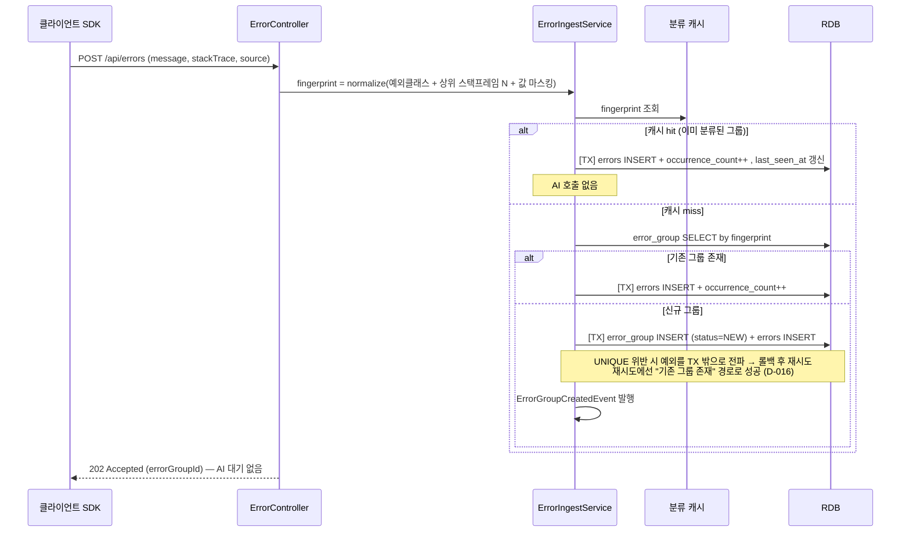
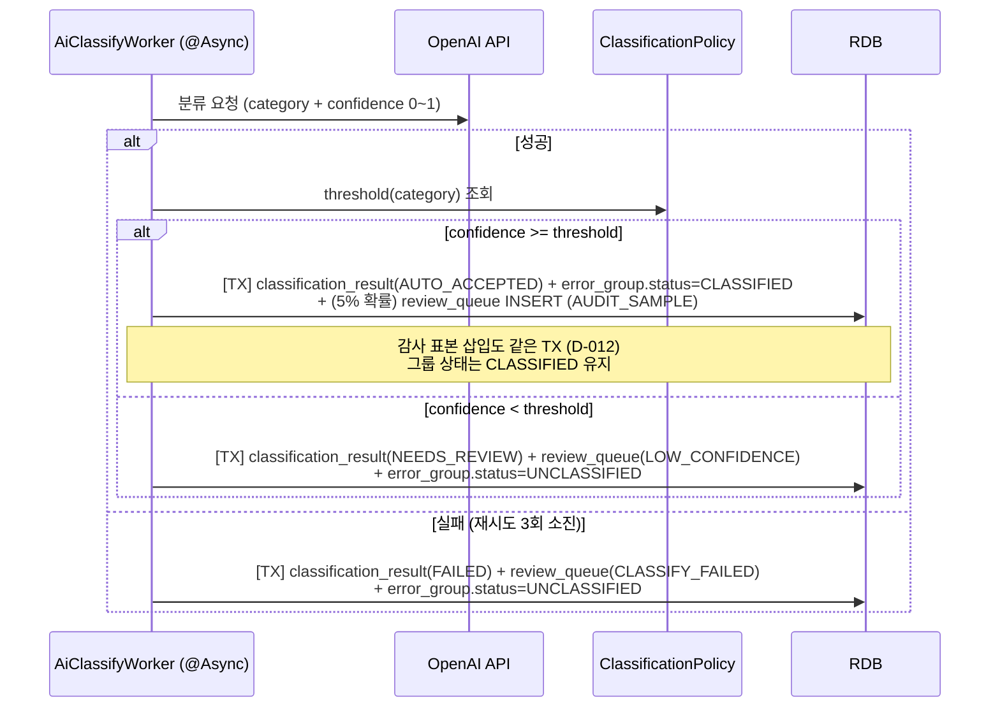
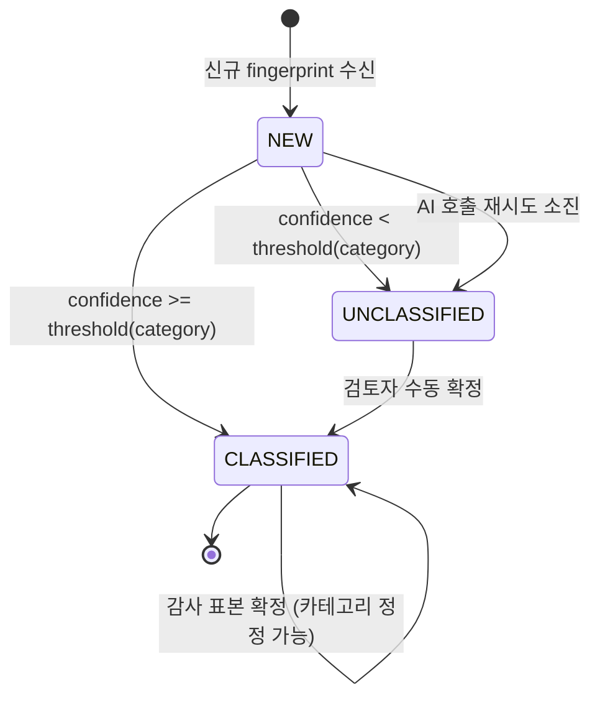

# PRD — AI 에러 분류 검증 파이프라인 (Verifiable Error Triage)

> 기획 단계 (라이프사이클 1단계) 산출물.
> 핵심 질문: **AI가 에러 메시지를 자동 분류할 때, 신뢰도가 낮은 결과를 어떻게 감지하고 처리할 것인가?**
> 그리고 한 단계 더: **AI가 "자신 있게" 틀렸을 때는 무엇으로 잡을 것인가?**
> 관련 의사결정: `DECISIONS.md` D-001 (주제 선정), D-002 (단계 책임자 분담), D-003 (기술 스택)

## 1. 한 줄 소개

여러 서비스에서 쏟아지는 에러를 **동일 에러 그룹 단위로 묶어** AI가 자동 분류하되, **신뢰도가 카테고리별 임계값 미만인 결과는 저장하지 않고 사람 검토 큐로 격리**하고, **자동 승인된 결과조차 일부를 무작위 감사**해서 오분류가 운영 데이터를 오염시키는 것을 막는 시스템.

AI 결과를 무조건 신뢰하는 파이프라인과의 차이는 두 가지다.

1. AI가 모른다고 말하지 않을 때에도 **"모른다"를 대신 판정한다** (임계값 검증)
2. AI가 안다고 말한 것도 **일부를 표본 검사한다** (감사 샘플링)

2번이 없으면 이 시스템은 결국 *"AI가 스스로 신고한 신뢰도"* 를 무조건 신뢰하는 것과 같다.

## 2. 페르소나

| 페르소나 | 권한 | 핵심 행동 | 진입점 |
| --- | --- | --- | --- |
| 클라이언트 앱 / SDK (`ROLE_INGEST`) | 에러 전송만 (읽기 전면 불가) | 자기 서비스에서 발생한 에러를 즉시 전송하고 응답 지연 없이 리턴받는다 | `POST /api/errors` |
| 검토자 / reviewer (`ROLE_REVIEWER`) | 검토 큐 조회 + 수동 분류 확정 + 에러 그룹 조회 | 격리된 에러 그룹을 확인하고 최종 카테고리를 확정한다 | `GET /api/review-queue`, `GET /api/error-groups` |
| 관리자 / admin (`ROLE_ADMIN`) | 검토자 권한 + **카테고리별 임계값 정책** + 감사 비율 설정 + 전체 통계 | 오분류 비용에 따라 카테고리별 임계값을 조정하고, 감사 결과·큐 적체를 관찰한다 | `GET /api/stats`, `PATCH /api/policies/{category}` |

> **권한 경계의 의도**: 에러를 *보내는* 주체 ≠ 분류를 *판정하는* 주체 ≠ 판정 기준을 *정하는* 주체. SDK 키가 유출돼도 검토 큐·통계·정책은 노출되지 않는다.
>
> **감사 샘플링의 blind 조건**: 검토자에게는 해당 항목이 감사 표본인지 노출하지 않는다. 알면 평소보다 신중하게 봐서 감사 결과가 실제 운영 정확도보다 낙관적으로 편향된다.

## 3. User Story

> 6 공통 필수 기능이 최소 1개씩 매핑되도록 구성. 각 스토리 뒤 대괄호가 매핑 기능.

### 수신 · 그룹핑

- **US-1**: (클라이언트 SDK)로서 (에러 1건을 전송)하고 (AI 분류 완료를 기다리지 않고 즉시 202 응답)을 받을 수 있다. — [비동기]
- **US-2**: (시스템)으로서 (스택트레이스를 정규화한 fingerprint로 동일 에러를 그룹핑)해서 (이미 분류된 그룹의 재발은 AI 재호출 없이 발생 횟수만 증가)시킬 수 있다. — [캐시 · 핵심 트랜잭션]
- **US-3**: (시스템)으로서 (같은 fingerprint가 동시에 처음 유입)될 때 (그룹을 단 1개만 생성하고 AI도 1회만 호출)할 수 있다. — [핵심 트랜잭션 · 동시성]

### AI 분류 · 검증

- **US-4**: (시스템)으로서 (신규 에러 그룹을 AI에 분류 요청)해서 (카테고리 + 0~1 신뢰도 점수)를 받을 수 있다. — [AI 보조]
- **US-5**: (시스템)으로서 (신뢰도를 **해당 카테고리의** 임계값과 비교)해서 (미만이면 `미분류` 처리 + 검토 큐 삽입을 한 트랜잭션으로) 수행할 수 있다. — [핵심 트랜잭션 · AI 보조]
- **US-6**: (시스템)으로서 (AI 호출 실패 시 3회 재시도)하고 (재시도 소진 시 `분류실패` 상태로 검토 큐에 자동 삽입)할 수 있다. — [비동기 · 재시도]
- **US-7**: (시스템)으로서 (임계값을 통과해 자동 승인된 그룹 중 설정된 비율(기본 5%)을 무작위 추출)해서 (`감사표본` 사유로 검토 큐에 삽입)할 수 있다. — [AI 보조]

### 검토

- **US-8**: (검토자)로서 (검토 큐를 상태 / 기간으로 필터)해서 (오래된 순으로 페이징 조회)하고, (에러 그룹은 상태 / 카테고리로 필터 + 발생 횟수 순 정렬)로 조회할 수 있다. — [검색·필터]
  - 검토 큐에서 **격리 사유·신뢰도·카테고리로는 필터할 수 없다** — 감사 표본 역산이 가능해지므로 (D-010)
- **US-9**: (검토자)로서 (격리된 그룹의 최종 카테고리를 확정)해서 (큐 항목 `RESOLVED` + 분류 결과 갱신 + 그룹 상태 전이를 원자적으로) 처리할 수 있다. — [핵심 트랜잭션]
- **US-10**: (검토자)로서 (다른 검토자가 이미 확정한 항목을 중복 확정)하려 할 때 (409 충돌 응답)을 받을 수 있다. — [핵심 트랜잭션 · 동시성]

### 정책 · 관측

- **US-11**: (관리자)로서 (카테고리별 신뢰도 임계값을 조정)해서 (오분류 비용이 큰 카테고리는 더 보수적으로 격리)할 수 있다. — [권한·역할]
- **US-12**: (관리자)로서 (신뢰도 구간별 실제 정확도와 큐 적체 요약)을 (매 조회마다 전수 count 쿼리 없이 빠르게) 확인할 수 있다. — [캐시]
- **US-13**: (클라이언트 SDK)로서 (검토 큐·통계·정책 endpoint에 접근)하려 하면 (403 Forbidden)을 받는다. — [권한·역할]

## 4. 핵심 흐름

### 4-0. 데이터 모델 (5 테이블)

```text
errors            (id, error_group_id FK, raw_message, stack_trace, source, occurred_at, created_at)
                  └ append-only 발생 로그. 개별 레코드는 상태를 갖지 않는다.

error_group       (id, fingerprint UNIQUE, sample_message, status, occurrence_count,
                   current_category, current_confidence,
                   first_seen_at, last_seen_at, created_at, updated_at)
                  └ 분류의 단위. status: NEW | CLASSIFIED | UNCLASSIFIED
                  └ current_* = classification_result 역정규화 사본. 목록 조회 조인 제거용 (D-011)

classification_result (id, error_group_id FK, category, confidence, model, raw_response,
                       verdict, final_category, attempt_count, created_at)
                  └ verdict: AUTO_ACCEPTED | NEEDS_REVIEW | FAILED
                  └ category = AI 제안, final_category = 사람 확정 (감사 대조의 핵심 2컬럼)

review_queue      (id, error_group_id FK, classification_result_id FK, reason, status,
                   reviewer_id, resolved_at, created_at, version)
                  └ version = 낙관적 락. 동시 확정 시 409 의 근거 (D-007)
                  └ reason: LOW_CONFIDENCE | CLASSIFY_FAILED | AUDIT_SAMPLE
                  └ status: PENDING | RESOLVED

classification_policy (category, threshold, updated_by, updated_at)
                  └ 카테고리별 임계값. 미등록 카테고리는 기본값 0.9 (보수적 = 격리 쪽)
```

> **그룹핑 도입의 파급효과 (설계 결정)**: 상태(`status`)의 소유 주체가 `errors`에서 `error_group`으로 **올라간다**. 개별 에러 발생 레코드는 상태 없는 append-only 로그가 되고, "분류됐는가 / 미분류인가"는 그룹의 속성이다. 같은 NPE가 1000번 나도 판정은 1번이어야 하기 때문이다.
>
> `classification_result`에 `category`(AI 제안)와 `final_category`(사람 확정)를 **둘 다 남기는 것**이 감사·캘리브레이션 측정의 전제다. 사람이 확정할 때 AI 제안을 덮어쓰면 오분류 증거가 사라진다.

### 4-1. 수신 → 그룹핑 (AI 호출을 줄이는 구간)



**설계 의도**

1. `POST /api/errors` 응답은 AI 호출과 **완전히 디커플링**된다. AI가 수 초 걸려도 클라이언트 응답시간에 영향이 없다.
2. **AI 호출은 신규 그룹에만 발생한다.** AI 절감을 만드는 것은 **그룹핑**이지 캐시가 아니다 — 캐시가 miss 여도 DB 에 그룹이 있으면 AI 를 부르지 않는다. 캐시가 줄이는 것은 **수신 경로의 DB 조회**다 (시스템 최고 QPS 지점). 두 지표를 분리해서 측정한다 (D-014):
   - AI 절감률 = `1 - (AI 호출 수 / 투입 건수)` ≈ `1 - (신규 그룹 수 / 투입 건수)`
   - 캐시 hit rate = `hit / (hit + miss)` — **항상 절감률 이하**. TTL 만료·재기동 시 miss 지만 AI 호출은 없다
3. 같은 fingerprint 동시 첫 유입은 실제 race condition이다. `fingerprint` unique 제약을 신뢰 근거로 삼는다 (선-조회 후-삽입만으로는 못 막는다). 단 **위반 예외를 같은 트랜잭션 안에서 캐치해 재조회하면 안 된다** — Hibernate가 세션을 오염된 것으로 보고 트랜잭션을 rollback-only로 마킹하므로 재조회가 실패한다. 예외를 트랜잭션 밖으로 전파시켜 롤백을 완료한 뒤 새 트랜잭션에서 재시도한다 (D-016).

### 4-2. AI 분류 → 검증 → 판정 (핵심 구간)



**분기별 트랜잭션 원자성이 왜 중요한가**

`NEEDS_REVIEW` / `FAILED` 분기에서 *"분류 결과는 저장됐는데 검토 큐 삽입이 실패"* 한 상태는 존재할 수 없어야 한다. 그 상태가 곧 **조용히 유실된 미분류 에러** — 이 시스템이 막으려는 바로 그 실패다.

**감사 표본 삽입도 같은 트랜잭션에 넣는다 (D-012).** 초안은 "감사는 부차적이니 실패해도 자동 승인을 되돌릴 필요 없다"는 이유로 별도 트랜잭션을 뒀는데, 이건 잘못이다 — 표본이 소리 없이 누락되면 실제 감사율이 5% 미달이 되고, **§8 측정 8(자동 승인 건 오분류율)의 분모가 조용히 줄어든다.** 측정 무결성이 이 프로젝트의 주제인데 측정 장치 자체를 best-effort 로 두는 셈이다.

"부차적이니 분리한다"는 직관은 **외부 의존성**에 적용되는 것이고, 여기 두 쓰기는 같은 DB·같은 커넥션이라 분리해서 얻는 격리 이득이 없다.

**단, 롤백된 그룹의 복구 경로가 Phase 2 에는 없다 (D-017).** 판정 트랜잭션이 롤백되면 그룹은 `NEW` 로 남는데, `ErrorGroupCreatedEvent` 는 이미 소비됐고 자동 재분류는 Phase 3(항목 G)이므로 **아무도 다시 분류하지 않는다.** 이 시스템이 막으려는 "조용히 유실된 에러"를 스스로 만드는 구멍이다. Phase 2 에서는 고치는 대신 **관찰 가능하게** 만든다:

- `GET /api/stats` 의 `classification.stuckNew` — 생성 후 N분(기본 10분) 이상 `NEW` 에 머무른 그룹 수
- Actuator gauge `triage.groups.stuck_new`
- 이 값이 0 이 아니면 분류 파이프라인이 조용히 실패하고 있다는 신호다. **재분류 스윕은 Phase 3 항목 G 로 이월** (재시도 소진·일시적 장애 복구와 같은 문제이므로 함께 처리하는 것이 맞다)

추가 안전장치로 **감사율 자체를 검증 가능하게** 만든다 — `GET /api/stats` 가 표본 수(`sampledTotal`)와 모집단 수(`eligibleTotal`), 실측 비율(`actualSampleRate`)을 함께 노출한다. 설정값 5% 와 실측값이 벌어지면 즉시 드러난다.

### 4-3. 에러 그룹 상태 전이



`UNCLASSIFIED → CLASSIFIED` 전이는 **오직 사람만** 일으킬 수 있다. AI는 이 전이 권한이 없다.
`CLASSIFIED → CLASSIFIED` 자기 전이는 감사 표본 경로다 — 이미 자동 승인된 그룹의 카테고리를 사람이 정정할 수 있고, 이때 `category ≠ final_category`가 되어 **오분류 1건이 기록된다.**

### 4-4. 검토 큐 처리 흐름

```text
검토자 로그인
  → GET /api/review-queue?status=PENDING (오래된 순, 페이징)
     · reason / confidence / threshold 를 응답에 포함하지 않는다 → 감사 표본 blind 유지
       (AUDIT_SAMPLE 은 정의상 confidence >= threshold 이므로 두 값만 주면 역산 가능, D-010)
     · AI 제안 카테고리 + 그룹 발생 횟수(occurrence_count)만 표시
  → PATCH /api/review-queue/{id} {"finalCategory": "DB_CONNECTION"}
  → [TX] 큐 항목 락 조회(중복 확정 방지) → status=RESOLVED
        + classification_result.final_category 기록
        + error_group.status=CLASSIFIED
  → 커밋 후 분류 캐시 갱신 + 적체 통계 캐시 evict
```

## 5. 비기능 요구사항

| 항목 | 목표 | 측정 방법 |
| --- | --- | --- |
| 사용자 규모 | 에러 수신 50 req/s, 동시 검토자 5명 | 부하 도구 실측 (아래) |
| `POST /api/errors` 응답시간 | p95 < 100ms (AI 호출 비동기 분리 전제) | `hey -n 2000 -c 50` **본인 실측만** |
| `GET /api/review-queue` 응답시간 | p95 < 200ms (10만 건 적체 기준) | 인덱스 전/후 `EXPLAIN` + `hey` 비교 |
| **AI 호출 절감률** (그룹핑 효과) | 반복 포함 1000건 투입 시 AI 호출 ≤ 50회 (**95%+ 절감**) | 호출 카운터 메트릭 실측 |
| **분류 캐시 hit rate** (DB 조회 절감) | ≥ 90% (반복 유입 시나리오). **절감률과 다른 지표** — 캐시 miss 여도 그룹이 있으면 AI 는 안 부른다 (D-014) | Actuator 캐시 메트릭 |
| 데이터 정합성 | 분류 결과 저장 ↔ 큐 삽입 all-or-nothing. 동시 확정 시 last-write-wins 금지. **동시 첫 유입 시 중복 그룹 0건** | 롤백 통합 테스트 + 동시 `PATCH` 테스트 + 동시 `POST` 테스트 |
| AI 신뢰성 | 신뢰도 0.8 이상 구간 분류 일치율 ≥ 90% | 정답 레이블 50건 대조 |
| **감사 유효성** | 자동 승인 건의 오분류율을 수치로 산출 가능. 단 앵커링 편향으로 **하한값** | 감사 표본 `category` vs `final_category` 대조 |
| **blind 무결성** | 검토 큐 응답만으로 감사 표본을 역산할 수 없어야 함 | 응답 필드 전수 점검 + 역산 가능성 리뷰 |
| 보안 | 에러 수신은 API key, 검토/정책 endpoint는 역할 기반 인가. OpenAI API key는 환경변수만 (`.env` commit 금지) | 403 케이스 E2E |

> `CLAUDE.md` AI 검증 규칙에 따라 **응답시간·throughput 수치는 AI 추정값을 evidence로 쓰지 않는다.** 위 목표치는 목표일 뿐이고, 확정 수치는 본인 `hey` / `wrk` 실측으로만 기록한다.

## 6. 6 공통 필수 기능 매핑

| 공통 기능 | 본 시스템 매핑 | 담당자 |
| --- | --- | --- |
| 권한·역할 | `ROLE_INGEST` / `ROLE_REVIEWER` / `ROLE_ADMIN` 3역할 + `@PreAuthorize`. 전송 주체 · 판정 주체 · 정책 결정 주체 분리 | 김준현 (P2 선작업) |
| 핵심 트랜잭션 | ① `ErrorIngestService.ingest` — 그룹 upsert + 발생 로그 삽입 + 카운트 증가<br>② `ClassificationService.verifyAndPersist` — 정책 조회 + 분류 결과 저장 + 그룹 상태 전이 + 조건부 큐 삽입<br>③ `ReviewService.confirm` — 큐 락 조회 + 확정 + 최종 카테고리 기록 + 그룹 전이 | ① 이용택 (P1)<br>② 김준현 (P2)<br>③ 김은빈 (P3) |
| 검색·필터 | `ReviewQueueRepository.search` — **status / 기간** 필터 + `(status, created_at)` 인덱스 (사유·신뢰도·카테고리 필터는 blind 규칙상 제공 안 함, D-010). `error_group`은 status / category 필터 + `occurrence_count` 또는 `last_seen_at` 정렬 | 김은빈 (P3) |
| 캐시 | ① `fingerprint → 그룹 요약` 캐시 — **시스템 최고 QPS 지점(수신 경로)의 DB 조회 제거**. 그룹 생성 시 put, 판정 확정 시 갱신. AI 절감은 그룹핑의 효과이고 캐시와는 별개 지표 (D-014)<br>② 큐 적체·감사 요약 통계 `@Cacheable` (TTL 10s) + `@CacheEvict(allEntries=true)`. Actuator gauge가 매 스크랩마다 전수 count 치는 것 방지 | ① 이용택·김준현 (계약 C)<br>② 김은빈 (P3) |
| 비동기·이벤트 | `ErrorGroupCreatedEvent` (Spring Events) → `@Async` AI 분류 워커 + `@Retryable(maxAttempts=3)` + `@Recover`로 큐 자동 삽입 | 이용택 발행 (P1) → 김준현 수신 (P2) |
| AI 보조 | `AiClassificationService` — 에러 → 카테고리 + 신뢰도<br>**+ 카테고리별 임계값 검증 계층**<br>**+ 자동 승인 건 무작위 감사 샘플링** (본 프로젝트의 차별점) | 김준현 (P2) |

> `@Transactional` 위치는 `CLAUDE.md` 규칙 준수 — Controller 금지, 단일 read 금지, 위 3개 묶음 read+write 메서드에만. 캐시 evict/갱신은 **커밋 후**에 수행한다 (롤백된 판정이 캐시에 남으면 안 됨).

## 7. 제약 사항

### Phase 2 (Week 9 · 5일) 범위

- 에러 수신 API + **5개 테이블** (`errors`, `error_group`, `classification_result`, `review_queue`, `classification_policy`) JPA 매핑
- **fingerprint 정규화 + 그룹핑** — 신규 그룹만 AI 호출, 동시 첫 유입 중복 방지
- AI 분류 + **카테고리별 임계값 검증 + 검토 큐 격리** (프로젝트 핵심 — 절대 뒤로 밀지 않음)
- **감사 샘플링** — 자동 승인 건 5% 무작위 격리 + `category` vs `final_category` 대조
- `@Transactional` 원자성 + 롤백 시나리오 테스트
- `@Async` + `@Retryable` 3회 + 소진 시 큐 자동 삽입
- 검토 큐 복합 필터 조회 + 수동 확정 API + `(status, created_at)` 인덱스
- 관리자 임계값 정책 조회·수정 API

### Phase 3 이후로 미루는 항목

| # | 항목 | 비고 |
| --- | --- | --- |
| — | **인증** | Phase 2는 `X-Api-Key` (ingest) + `X-User-Id` / `X-User-Role` 헤더 stub. **JWT 본격 통합은 Phase 3** |
| — | **Actuator 커스텀 메트릭** | Phase 2는 endpoint 노출까지 (분류 성공률, 큐 적체, AI 호출 수, 캐시 hit rate). 대시보드 연동은 Phase 3 |
| D | **캘리브레이션 리포트** | 감사 데이터 누적 후 신뢰도 구간별 *실제* 정확도 산출 → 임계값 재조정 (`DECISIONS.md` 후속 항목). Phase 2는 원시 대조 데이터 확보까지 |
| E | **검토 항목 claim(선점)** | 확정 충돌을 409로 막는 대신 선점 + TTL 반납. 낙관 vs 비관 락 비교 실측 |
| F | **검토 우선순위 스코어링** | `occurrence_count × 심각도 × (1 - confidence)` 복합 정렬 + 전용 인덱스 |
| G | **실패 유형 구분 + 백오프 재분류** | 일시적(429/5xx) vs 영구적(파싱 실패) 구분, 스케줄러 재분류, circuit breaker |
| H | **이중 모델 불일치 격리** | 두 모델 결과 상이 시 신뢰도와 무관하게 격리 (신뢰도 과신을 잡는 두 번째 축) |
| I | **2단계 공개 검토** | 검토자가 먼저 독립적으로 분류 → 제출 후 AI 제안 공개. 앵커링 편향 제거로 오분류율을 하한값이 아닌 실측값으로 (D-010) |
| — | 미분류 자동 재분류, 카테고리 체계 자동 학습, 멀티테넌시 | MVP 제외 |
| — | 프론트엔드 화면 | 없음. E2E는 API 레벨(`tests/e2e/api.spec.ts`)로 검증 |

### 알려진 리스크와 대응

| 리스크 | 대응 |
| --- | --- |
| **fingerprint 과도 병합** — 정규화가 공격적이면 다른 에러가 한 그룹에 묶여 **오분류 1건이 그룹 전체(수천 건)로 전파** | 정규화 단계를 예외클래스 + 상위 3프레임 + 값 마스킹으로 한정. 그룹마다 `sample_message` 보관해 검토자가 이상 병합을 감지 가능하게. 투입 건수 대비 그룹 수를 측정해 검증 |
| **fingerprint 과소 병합** — 라인번호·동적값이 남아 같은 에러가 여러 그룹 → AI 절감 실패 | 마스킹 규칙(숫자·UUID·타임스탬프·경로) 단위 테스트. 절감률 목표(95%) 미달 시 규칙 보강 |
| OpenAI API가 신뢰도 점수를 직접 주지 않음 | 프롬프트로 `{"category":..., "confidence":0.0~1.0}` JSON 강제. 파싱 실패 시 `confidence=0`으로 간주해 **무조건 격리** (fail-safe 방향) |
| 트랜잭션 범위 설계 실수로 롤백이 안 먹음 | 롤백 시나리오 통합 테스트를 **Day 3 필수 체크포인트**로 지정 |
| **감사 표본이 통계적으로 부족** — 자동 승인이 하루 100건이면 5건/일 | 감사 비율을 설정 가능하게 (ADMIN). Phase 2 측정은 정답 레이블 50건 실험 투입으로 표본 확보 |
| **감사 blind 누설** — 검토자가 감사 건임을 알면 결과가 낙관적으로 편향 | `reason` 뿐 아니라 `confidence`·`threshold`·`category` 필터까지 모두 미노출. `AUDIT_SAMPLE` 은 정의상 `confidence >= threshold` 라 두 값만으로 역산되기 때문 (D-010). 신규 응답 필드 추가 시 역산 가능성 점검을 의무화 |
| **앵커링 편향** — AI 제안 카테고리를 보여주므로 검토자가 동의 쪽으로 기울고, 수집된 정답 레이블이 오염 | Phase 2 는 한계로 수용하고 **측정된 오분류율을 하한값으로 해석**. 사람이 먼저 분류 → 그 후 AI 제안 공개하는 2단계 방식은 Phase 3 (항목 I) |
| AI 응답 지연이 수신 API 응답시간에 전파 | 이벤트 + `@Async` 분리. 수신 API는 그룹 upsert + INSERT만 하고 리턴 |
| **AI API 장기 장애 시 전건 수동 처리 대상화** | Phase 2에서는 한계로 명시만 (재시도 3회 소진 → 큐). 백오프 재분류·circuit breaker는 Phase 3 (G) |
| **판정 트랜잭션 롤백 시 그룹이 `NEW` 로 영구 방치** — 이벤트는 이미 소비됐고 자동 재분류가 없어 아무도 다시 분류하지 않는다 | Phase 2는 **관찰까지만** — `stats.classification.stuckNew` + Actuator gauge `triage.groups.stuck_new` 로 노출해 조용한 유실을 드러낸다. 재분류 스윕은 Phase 3 (G). **측정 3(롤백 검증) 시 stuckNew가 실제로 증가하는지 함께 확인**한다 (D-017) |
| 신규 카테고리에 임계값 미등록 | 기본값 0.9로 fallback — **보수적 = 격리 쪽**으로 실패한다 |
| 검토 큐 적체 시 수동 처리 부담 | MVP는 수동 확정 API만. 적체를 메트릭으로 노출해 **적체 자체를 관찰 가능하게** 만드는 것까지가 Phase 2 목표 |

## 8. 성공 지표 (Phase 2 종료 시점)

### 미션 통과 조건

- [ ] 6 공통 필수 기능 모두 구현 (§6 표 전체)
- [ ] 라이프사이클 5 단계 모두 산출물 1개 이상 (`LIFECYCLE-COVERAGE.md`)
- [ ] 8 PR 이상 머지 + 모두 team-pr-guard / AI Review CI green
- [ ] 핵심 흐름 시연 1사이클: **신뢰도 낮은 에러 투입 → 자동 격리 → 검토자 확정**
- [ ] 차별 흐름 시연 1사이클: **자동 승인된 에러가 감사 표본으로 뽑혀 → 사람이 카테고리 정정 → 오분류 1건으로 집계**

### 도메인 측정 지표 (본인 실측만 기록)

| # | 측정 | 방법 | 기록 위치 |
| --- | --- | --- | --- |
| 1 | AI 분류 일치율 | 에러 유형 10종 × 5건 = 50건 투입, 신뢰도 구간별(0~0.5 / 0.5~0.8 / 0.8~1.0) 정답 대조 | `evidence/` 비교 표 |
| 2 | 검토 큐 적체율 | 50건 투입 후 사유별(`LOW_CONFIDENCE` / `CLASSIFY_FAILED` / `AUDIT_SAMPLE`) 삽입 건수 / 전체 비율 | `evidence/` |
| 3 | 트랜잭션 롤백 검증 | 큐 삽입 강제 실패 주입 → `classification_result` 롤백 여부 확인 | 통합 테스트 |
| 4 | 재시도 동작 | AI API 오류 주입 → 재시도 횟수·간격 로그 + 최종 큐 삽입 확인 | 구조화 로그 |
| 5 | 인덱스 효과 | 아래 4개 케이스 `EXPLAIN` 비교 (D-018)<br>ⓐ 검토 큐 `(status, created_at)` 전/후<br>ⓑ `sort=occurrenceCount` + category<br>ⓒ `sort=lastSeenAt` + 기간 (category 없음)<br>ⓓ **`sort=lastSeenAt` + 기간 + category 동시** — `(status, last_seen_at)` 만으로는 category 미커버라 filesort/추가 필터링이 남는지, 3컬럼 인덱스가 값어치 있는지 확인 | `evidence/` |
| 6 | **AI 호출 절감률** | 반복 포함 1000건 투입 → 실제 AI 호출 횟수 + 생성된 그룹 수. **절감률 = 1 - (AI 호출/투입)** 으로만 정의한다. 캐시 hit rate 로 대체하지 않는다 (D-014) | `evidence/` |
| 7 | **동시 유입 중복 방지** | 같은 fingerprint 20 스레드 동시 `POST` → 그룹 1개 / AI 호출 1회 확인 | 동시성 테스트 |
| 8 | **자동 승인 건 오분류율** | 감사 표본에서 `category ≠ final_category` 비율. 신뢰도 구간별로 분해. **앵커링 편향으로 하한값임을 명시** (D-010) | `evidence/` |
| 9 | **카테고리별 임계값 효과** | 동일 50건을 ⓐ전역 단일값 0.7(D-006 이전 초안 = 대조군) vs ⓑ카테고리별 차등으로 각각 처리 → 격리 건수·오분류 통과 건수 비교 | `evidence/` |
| 10 | **blind 무결성** | 검토 큐 응답 필드 전수 점검. **결정적 역산**(필드 조합으로 100% 식별)은 0건이어야 하며 발견 시 필드 제거. **확률적 추론**(`sampleMessage`·`occurrenceCount` 로 짐작)은 제거 불가하므로 목록화만 (D-019) | 리뷰 메모 |
| 11 | **캐시 hit rate** | 측정 6과 **별개 지표**. 같은 1000건 투입에서 hit/miss 카운터 기록 후 절감률과의 격차를 확인 — 격차 = "캐시 miss 지만 그룹은 존재" 비율 (D-014) | `evidence/` |

### 이 프로젝트의 성공 기준 두 줄

1. AI가 틀렸을 때 시스템이 **조용히 틀리지 않고, 큐에 쌓이며 관찰 가능하게 틀리는가.**
2. AI가 **자신 있게** 틀렸을 때, 그 사실을 **수치로 말할 수 있는가.**
3. 그 수치가 **어느 방향으로 얼마나 편향됐는지**까지 말할 수 있는가 (하한값 해석).

## 9. 출처 · 참고

- [NAVER D2 · SaaS 대체하기: AI와 함께한 광고SDK 에러 모니터링 시스템 구축기](https://d2.naver.com/helloworld/8319114) — 원 사례. 본 PRD는 이를 백엔드 검증 파이프라인 관점으로 축소·재해석함
