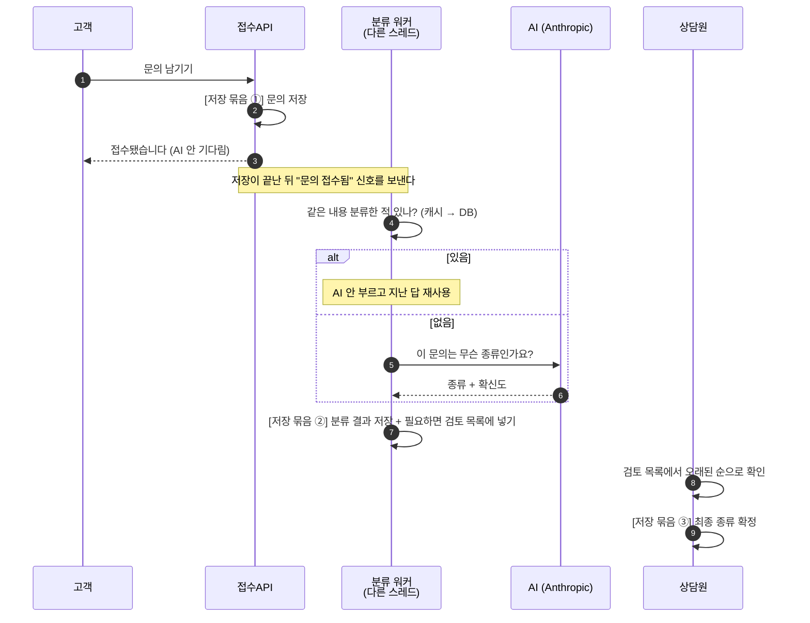
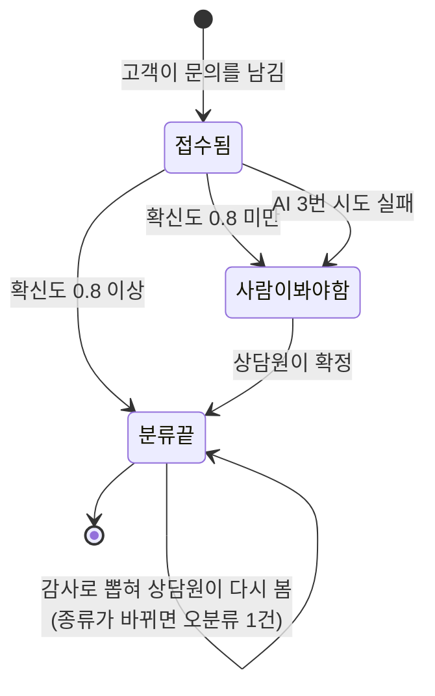

# PRD — AI 문의 분류 검증 파이프라인

> 기획 단계 산출물. 왜 그렇게 정했는지는 `DECISIONS.md`, API 규격은 `API-CONTRACT.md`, 코딩 규칙은 `CLAUDE.md`.
> 모르는 단어는 [`GLOSSARY.md`](./GLOSSARY.md).

## 1. 한 줄 소개

고객이 남긴 문의를 AI가 자동으로 분류하되, **AI가 확신하지 못한 건은 사람에게 넘기고, 확신한 건도 일부를 몰래 뽑아 사람이 다시 본다.**

두 번째가 이 프로젝트의 핵심이다. AI는 틀렸으면서 확신하는 경우가 있는데, 그런 건 "확신도가 낮으면 사람에게"라는 규칙만으로는 절대 못 잡는다. 그래서 자동으로 통과한 것 중 20건에 1건을 뽑아 사람이 다시 확인하고, **AI 답과 사람 답이 다른 비율을 숫자로 낸다.**

## 2. 쓰는 사람 3명

| 사람 | 할 수 있는 일 | 못 하는 일 |
| --- | --- | --- |
| 고객 | 문의 남기기, 자기 문의 보기 | 남의 문의·검토 목록·통계 보기 |
| 상담원 | 검토 목록 보기, 최종 분류 확정하기 | 통계 보기 |
| 운영 매니저 | 위 전부 + 전체 통계 보기 | 설정 변경 (이번 범위에서는 불가) |

**셋을 나눈 이유**: 문의를 남기는 사람이 분류까지 확정하면 검증이 성립하지 않는다. 고객 계정이 털려도 검토 목록과 통계는 안 보이게 막는다.

## 3. 핵심 흐름

```text
① 고객이 문의를 남긴다
       ↓  (AI를 기다리지 않고 바로 "접수됐습니다" 응답)
② 뒤에서 AI가 분류한다 — "환불 문의 같고, 확신도 0.85"
       ↓
③ 확신도를 기준값(0.8)과 비교한다
       ├─ 0.8 이상 → 자동 확정
       │      └─ 이 중 20건에 1건은 몰래 뽑아 검토 목록에 넣는다   ← 감사
       └─ 0.8 미만 → 확정하지 않고 검토 목록에 넣는다
       ↓
④ 상담원이 검토 목록을 열어 최종 분류를 확정한다
       ↓
⑤ AI 답과 사람 답이 다르면 오분류 1건으로 센다
```

AI 호출이 실패하면 3번까지 다시 시도하고, 그래도 안 되면 검토 목록에 넣는다. **조용히 사라지는 문의가 없게 하는 것**이 이 흐름의 목표다.

같은 흐름을 시간 순서로 그리면 이렇다. 점선이 응답이고, `[저장 묶음]`은 한 덩어리로 저장되는 구간이다.



## 4. 사용자 이야기

US-1~9는 팀이 합의한 번호 그대로다. 10~13은 설계하면서 추가했다.

| 번호 | 내용 |
| --- | --- |
| US-1 | 고객은 분류를 기다리지 않고 바로 접수 확인을 받는다 |
| US-2 | 시스템은 접수 후 뒤에서 AI를 불러 분류와 확신도를 받는다 |
| US-3 | AI 호출이 실패하면 3번까지 다시 시도하고, 그래도 안 되면 검토 목록에 넣는다 |
| US-4 | 확신도가 기준값 이상이면 자동으로 확정한다 |
| US-5 | 확신도가 기준값 미만이면 확정하지 않고 검토 목록에 넣는다 |
| US-6 | 상담원은 검토할 문의를 오래된 순으로 본다 |
| US-7 | 상담원은 검토 목록에서 최종 분류를 확정한다 |
| US-8 | 운영 매니저는 분류 성공률과 밀린 검토 건수를 본다 |
| US-9 | 개발자는 분류 저장은 됐는데 검토 목록 넣기가 실패했을 때, **문의 원문은 남아 있는지** 확인한다 |
| US-10 | 시스템은 자동 확정된 문의 중 5%를 뽑아 검토 목록에 넣는다 (감사) |
| US-11 | 상담원이 이미 확정된 항목을 또 확정하려 하면 409로 막는다 |
| US-12 | 같은 내용의 문의가 또 오면 AI를 다시 부르지 않는다 |
| US-13 | 고객이 검토 목록이나 통계에 접근하면 403으로 막는다 |

> **US-9는 팀 원안을 뒤집었다.** 원안은 "문의 원문 저장까지 되돌아가는지 확인"이었는데, US-2에서 접수와 분류를 이미 분리했으므로 접수는 그 시점에 저장이 끝나 있다. 원안대로 되돌리면 **고객이 이미 받은 접수 확인이 거짓말이 된다.** 그래서 "분류 결과는 되돌아가고 문의 원문은 남는지"를 확인하는 것으로 바꿨다 (D-030).

## 5. 만들 기능 6가지

### 5-1. 권한·역할

**어떤 문제가 있는가**
문의를 남기는 사람과 분류를 확정하는 사람이 같으면, AI가 맞았는지 틀렸는지 검증할 방법이 없다.

**왜 필요한가**
이 프로젝트는 "AI를 믿지 않고 검증한다"가 주제인데, 검증하는 사람이 분리돼 있지 않으면 주제 자체가 성립하지 않는다.

**어떻게 구현할 것인가**
- 역할 3개: `ROLE_CUSTOMER` / `ROLE_AGENT` / `ROLE_MANAGER`
- 메서드에 권한 표시를 붙여 막는다 (`@PreAuthorize`)
- 이번 범위에서는 실제 로그인 대신 요청 헤더로 역할을 받는다. 진짜 인증(JWT)은 나중에
- 남의 문의를 조회하면 404가 아니라 **403**을 준다. 404를 주면 번호를 하나씩 넣어보며 "이 문의가 있구나"를 알아낼 수 있다

**어떻게 확인할 것인가**
고객 역할로 검토 목록에 접근해 403이 나오는지 테스트한다 (US-13).

### 5-2. 핵심 트랜잭션 — 여러 저장을 한 덩어리로 묶기

**어떤 문제가 있는가**
분류 결과는 저장됐는데 검토 목록에 넣는 것이 실패하면, **아무도 모르게 사라진 문의**가 생긴다. 사람이 봐야 하는 건인데 목록에 없으니 영원히 안 보인다.

**왜 필요한가**
그게 바로 이 시스템이 막으려는 실패다. 조용히 틀리면 안 된다.

**어떻게 구현할 것인가**
저장을 한 덩어리로 묶는 곳은 **딱 세 군데**다 (`@Transactional`).

| | 하는 일 | 담당 |
| --- | --- | --- |
| ① | 문의 저장 | 이용택 |
| ② | 분류 결과 저장 + 문의 상태 변경 + (필요하면) 검토 목록에 넣기 | 김준현 |
| ③ | 검토 확정 + 최종 분류 기록 + 문의 상태 변경 | 김은빈 |

**①과 ②는 반드시 따로 둔다.** ①은 고객에게 접수 확인을 보낸 시점에 이미 저장이 끝나 있어야 하고, ②가 실패해도 ①은 남아야 한다.

②가 실패하면 문의가 "접수됨" 상태로 계속 남는데, 지금은 다시 분류해주는 기능이 없다. **이번 범위에서는 고치지 않고 눈에 보이게만 만든다** — 오래 멈춰 있는 문의 수를 지표로 내보낸다 (`stuckReceived`).

감사로 뽑은 건을 검토 목록에 넣는 작업도 ② 안에 넣는다. 밖에 두면 조용히 빠질 수 있고, 그러면 감사한 건수가 줄어 오분류율이 실제와 달라진다.

**어떻게 확인할 것인가**
검토 목록에 넣는 것을 일부러 실패시키고 → 분류 결과는 되돌아가고 문의 원문은 남는지, 그리고 `stuckReceived`가 올라가는지 본다 (측정 3).

### 5-3. 검색·필터

**어떤 문제가 있는가**
검토할 문의가 쌓이면 상담원이 어디부터 봐야 할지 모른다. 건수가 많아지면 목록 조회도 느려진다.

**왜 필요한가**
오래된 것부터 처리해야 밀리지 않는다.

**어떻게 구현할 것인가**
- `GET /api/inquiry-review-queue` — 상태와 기간으로 거르고 **오래된 순**으로 정렬
- `(status, created_at)` 두 컬럼을 묶은 인덱스를 만들어 DB가 결과를 따로 정렬하지 않게 한다
- **거를 수 없는 항목이 있다**: 왜 검토 목록에 들어왔는지(사유), AI 확신도, 기준값. 이유는 5-6 참조
- 목록을 뽑을 때 항목마다 추가 쿼리가 나가지 않게 한 번에 가져온다 (N+1 문제 → `@EntityGraph`)

**어떻게 확인할 것인가**
쿼리 실행 계획(`EXPLAIN`)을 인덱스 적용 전후로 비교한다. 그리고 N+1을 없애기 전후의 쿼리 개수를 센다 (측정 5, 속도 목표 b).

### 5-4. 캐시

**어떤 문제가 있는가**
같은 내용의 문의가 여러 번 오는데 그때마다 AI를 부르면 돈과 시간이 낭비된다. 통계 화면도 볼 때마다 전체 건수를 세면 느려진다.

**왜 필요한가**
자주 읽지만 잘 안 바뀌는 값이라 저장해두고 재사용하기 좋다.

**어떻게 구현할 것인가**

캐시를 두 군데 쓴다.

**(1) 같은 문의를 다시 분류하지 않기**

문의 본문을 짧게 줄인 문자열(정규화 키)을 만들어 두고, 같은 키를 이미 분류한 적 있으면 그 답을 재사용한다.

```text
캐시에 있나?                        → 있으면 재사용 (AI 안 부름)
없으면, DB에 같은 키의 지난 분류가 있나?  → 있으면 재사용 (AI 안 부름) + 캐시에 저장
그것도 없으면                        → AI 호출
```

DB까지 찾아보는 두 번째 단계를 둔 이유는, 캐시만 쓰면 서버를 다시 켤 때 절약이 0으로 돌아가기 때문이다.

⚠️ **문의를 묶는 게 아니다.** 문의는 각각 따로 저장되고 각각 따로 판정된다. 재사용하는 건 **AI 호출뿐**이다. 정규화 키가 같다는 이유로 여러 문의의 상태를 한꺼번에 바꾸면 안 된다.

정규화 규칙은 소문자로 바꾸기, 띄어쓰기·문장부호 정리, 주문번호·날짜·금액·연락처 가리기다. 얼마나 세게 가릴지는 재보고 정한다.

**(2) 통계 요약 저장해두기**

밀린 건수와 감사 결과 요약을 10초 동안 저장해둔다. 지표를 가져갈 때마다 전체 건수를 세지 않게 하기 위해서다.

**어떻게 확인할 것인가**
- 같은 문의를 섞어 1000건 넣고 **AI를 실제로 몇 번 불렀는지** 센다 (측정 6)
- 캐시에서 찾은 비율도 따로 센다 (측정 11). 이 둘은 다른 숫자다 — 캐시에 없어도 DB에 있으면 AI를 안 부르므로 캐시 쪽 비율이 항상 더 낮다
- 정규화가 잘못되는 두 방향을 각각 테스트한다: **서로 다른 문의를 같다고 보는 경우**와 **같은 문의를 다르다고 보는 경우**. 앞쪽이 더 위험하다. 틀린 분류가 조용히 재사용되기 때문이다

### 5-5. 비동기·이벤트 — 뒤에서 처리하기

**어떤 문제가 있는가**
AI 호출은 몇 초가 걸린다. 접수 API가 그걸 기다리면 고객도 몇 초를 기다린다.

**왜 필요한가**
고객은 "접수됐습니다"만 빨리 받으면 된다. 분류는 나중에 끝나도 된다.

**어떻게 구현할 것인가**
- 문의 저장이 끝난 뒤 "문의 접수됨" 신호를 보낸다 (`InquiryReceivedEvent`). 저장이 확정된 다음에 보낸다
- 그 신호를 받은 쪽이 **다른 스레드**에서 AI를 부른다 (`@Async`)
- 실패하면 3번까지 다시 시도한다 (`@Retryable`)
- 3번을 다 쓰면 마지막 처리로 넘어가 **검토 목록에 넣는다** (`@Recover`). 조용히 넘어가지 않는다

**어떻게 확인할 것인가**
AI 호출에 일부러 오류를 내고 → 재시도가 몇 번 도는지 로그로 보고 → 마지막에 검토 목록에 들어가는지 확인한다 (측정 4).

### 5-6. AI 보조

**어떤 문제가 있는가**
AI에게 분류를 시키면 답은 준다. 그런데 **그 답이 맞는지 아무도 확인하지 않는다.** 특히 AI가 확신한다고 말하면서 틀린 경우가 문제다.

**왜 필요한가**
AI가 스스로 매긴 확신도를 그냥 믿으면, 그건 검증이 아니라 그냥 AI를 쓰는 것이다.

**어떻게 구현할 것인가**

**(1) 분류 요청**
답을 정해진 형식으로 달라고 요청한다: `{"category": "...", "confidence": 0.0~1.0}`
답이 깨져서 못 읽으면 **무조건 사람에게 넘긴다.** 애매할 때는 항상 사람 쪽으로 넘기는 게 안전하다.

이때 **확신도에 0을 쓰지 않고 비워둔다.** 0을 쓰면 나중에 "AI가 0이라고 답한 건"과 "답이 깨져서 못 읽은 건"이 섞여 구분이 안 된다.

**(2) 기준값 검사**
확신도가 기준값(0.8) 이상이면 자동 확정, 미만이면 검토 목록으로 보낸다. 기준값은 설정 파일에 두고 실행 중에는 바꾸지 않는다. 실행 중에 바꾸면 나중에 "이 결과가 어느 기준으로 나온 건지" 알 수 없다.

판정은 세 갈래로 갈리고, **세 갈래 모두 저장 묶음 ② 안에서 처리된다.**


**(3) 감사 — 이 프로젝트의 차별점**
자동 확정된 것 중 5%를 무작위로 뽑아 검토 목록에 넣는다. 상담원이 다시 분류하고, **AI 답과 다르면 오분류 1건**으로 센다.

이때 **상담원에게 "이건 감사로 뽑힌 겁니다"라고 알려주지 않는다.** 알면 평소보다 신중하게 봐서 결과가 실제보다 좋게 나오기 때문이다.

그래서 검토 목록 응답에서 **사유·AI 확신도·기준값 세 개를 모두 뺀다.** 사유만 가리면 소용없다 — 감사로 뽑힌 건은 원래 "확신도 ≥ 기준값"인 것들이라, 확신도와 기준값을 주면 뺄셈 한 번으로 전부 골라낼 수 있다.

다만 **AI가 제안한 분류는 보여준다.** 이것까지 가리면 상담원이 일을 못 한다. 대신 AI 답을 먼저 보면 그쪽으로 판단이 끌려가므로, **측정된 오분류율은 실제보다 낮게 나온다고 보고 읽는다.**

**어떻게 확인할 것인가**
- 문의 종류 10가지 × 5건 = 50건을 넣고 정답과 맞춰본다 (측정 1)
- 감사로 뽑힌 건에서 AI 답과 사람 답이 다른 비율을 확신도 구간별로 낸다 (측정 8) — **이게 이 프로젝트의 결론이다**
- 검토 목록 응답 항목을 하나씩 보며 감사 대상을 알아낼 수 있는지 점검한다 (측정 10)
- 같은 문의 20건을 상담원 2명이 따로 분류해 얼마나 일치하는지 본다 (측정 12). 오분류율 중 "사람끼리도 갈리는 몫"을 떼어내기 위해서다

## 6. 데이터베이스 표 3개

| 표 이름 | 무엇을 담나 |
| --- | --- |
| `inquiries` | 고객이 남긴 문의. **분류의 단위이고 상태를 여기서 관리한다** |
| `inquiry_classification_result` | AI가 낸 답 + 사람이 고친 답. 둘 다 남긴다 |
| `inquiry_review_queue` | 사람이 봐야 할 목록 |

```text
inquiries
  id, customer_id, content(문의 본문), channel(들어온 경로),
  normalized_key(정규화 키), status(RECEIVED | CLASSIFIED | UNCLASSIFIED),
  current_category, current_confidence, received_at, created_at, updated_at

inquiry_classification_result
  id, inquiry_id, category(AI 답), confidence(확신도),
  model(AI 모델명 또는 재사용 표시), raw_response(AI 원본 응답),
  verdict(판정: AUTO_ACCEPTED | NEEDS_REVIEW | FAILED),
  final_category(사람이 확정한 답), attempt_count(시도 횟수), created_at

inquiry_review_queue
  id, inquiry_id, classification_result_id,
  reason(사유: LOW_CONFIDENCE | CLASSIFY_FAILED | AUDIT_SAMPLE),
  status(PENDING | RESOLVED), agent_id, resolved_at, created_at, version
```

문의의 상태는 셋뿐이고, 이렇게 옮겨 다닌다.



**"사람이 봐야 함"에서 "분류 끝"으로 가는 화살표는 사람만 그을 수 있다.** AI가 자기가 격리한 걸 자기가 푼다면 그건 검증이 아니다.

"접수됨"에 머물러 있는 것은 **정상(분류 대기)일 수도 있고 유실(② 실패)일 수도 있다.** 둘을 시간으로 가른 것이 `stuckReceived`다.

**꼭 지킬 것 3가지**

1. 사람이 최종 분류를 기록할 때 **AI 답을 덮어쓰지 않는다.** 덮어쓰면 AI가 틀렸다는 증거가 사라진다
2. "사람이 봐야 함"에서 "분류 끝"으로 바꾸는 건 **사람만** 할 수 있다. AI에게는 이 권한이 없다
3. `inquiries`의 `current_category` / `current_confidence`는 분류 결과를 복사해둔 값이다. 목록을 빠르게 보려고 둔 것이니 **판정이 확정되는 ②③ 안에서만** 바꾼다

`version`은 두 상담원이 같은 항목을 동시에 확정하려 할 때 뒤쪽을 막기 위한 값이다. 상태 검사와 **둘 다** 있어야 한다 — 상태만 보면 동시에 들어온 요청이 둘 다 통과해버린다.

## 7. 문의 종류 10가지

**분류 기준은 문의의 원인이 아니라 고객이 요구하는 조치다.** "배송이 늦어서 환불해주세요"는 원인이 배송이어도 요구가 환불이므로 `RETURN_REFUND`다. 이 규칙 하나가 분류를 명확하게 만든다.

| 종류 | 무엇 | 헷갈리는 경계 |
| --- | --- | --- |
| `DELIVERY` | 배송 상태·지연·분실·주소 변경 | 환불을 요구하면 `RETURN_REFUND` |
| `RETURN_REFUND` | 반품·교환·환불 | 발송 **전** 취소는 `ORDER_CHANGE` |
| `PAYMENT` | 결제 수단·결제 실패·중복 청구 | 환불 **금액** 이의는 `RETURN_REFUND` |
| `PRODUCT` | 상품 사양·재고 (주로 구매 전) | 받은 상품 하자는 `RETURN_REFUND` |
| `ACCOUNT` | 로그인·비밀번호·회원정보·탈퇴 | 결제 수단 등록 실패는 `PAYMENT` |
| `ORDER_CHANGE` | 발송 **전** 주문 변경·취소 | 발송 **후**면 `RETURN_REFUND` |
| `PROMOTION` | 쿠폰·적립금·할인·이벤트 | 쿠폰 쓴 결제가 실패하면 `PAYMENT` |
| `SERVICE_USAGE` | 앱·웹 사용법 (상품 아님) | 상품 사용법은 `PRODUCT` |
| `COMPLAINT` | 요구사항 **없이** 불만만 있는 경우 | 요구가 있으면 그 요구의 종류로 |
| `ETC` | 위 9가지에 없음 | **판단이 어려워서 고르는 칸이 아니다** |

> 정답을 만들 때 `ETC`가 10%를 넘으면 종류 정의가 잘못된 것이다. 그때는 위 표부터 고친다.

## 8. 5일 동안 만들 것

- 문의 접수 API + DB 표 3개
- 정규화 키 만들기 + AI 다시 부르지 않기
- AI 분류 + 기준값 검사 + 검토 목록으로 보내기 **(핵심 — 절대 뒤로 미루지 않는다)**
- 감사 5% 뽑기 + AI 답과 사람 답 비교
- 뒤에서 처리하기 + 3번 재시도 + 실패하면 검토 목록
- 검토 목록 조회 + 확정 API
- 되돌아가는지 확인하는 테스트

### 나중에 할 것

| | 내용 | 왜 미루나 |
| --- | --- | --- |
| A | 같은 문제의 문의를 묶어서 한 번에 처리 | 팀 협의로 이번 범위에서 뺐다. 되살리려면 `DECISIONS.md` D-030을 먼저 볼 것 |
| B | 문의 종류마다 기준값을 다르게 | 팀 협의로 뺐다. 지금은 기준값 하나 |
| C | 기준값을 화면에서 바꾸기 | 실행 중에 바꾸면 측정 결과를 믿을 수 없다 |
| D | 진짜 로그인(JWT) | 이번 범위는 헤더로 대신한다 |
| E | 멈춘 문의 자동 재분류 | 이번 범위는 눈에 보이게 하는 것까지 |
| F | AI가 죽었을 때 기다렸다 재시도 | 3번 재시도까지가 이번 범위 |
| G | 감사 비율을 실행 중에 바꾸기 | C와 같은 이유 |
| **H** | **상담원이 검토 항목을 열면 "내가 처리 중"으로 잡아두기** | 지금은 두 상담원이 같은 문의를 동시에 붙들고 각자 분류한 뒤, 확정할 때가 되어서야 한 명이 409를 받는다. 늦게 누른 쪽의 작업이 통째로 버려진다. **여유가 생기면 A~G 중 가장 먼저 붙인다** (D-031) |

### 알고 있는 위험

| 위험 | 어떻게 대응하나 |
| --- | --- |
| **정규화 키가 거의 안 겹칠 수 있다** — 고객이 쓴 문장은 제각각이라 똑같기 어렵다 | **가장 큰 위험이다.** 측정 6에서 절약이 안 나오면 가리는 범위를 넓힌다. 그래도 안 되면 캐시를 다른 곳에 쓰는 것을 다시 검토한다 |
| 반대로 너무 많이 가리면 다른 문의가 같은 키가 된다 | 두 방향을 다 테스트한다. 이쪽이 더 위험하다 |
| 문의 종류 경계가 애매해 사람마다 다르게 분류 | §7 경계 표 + "원인이 아니라 조치" 규칙. 측정 12로 확인하고 안 맞으면 표를 고친다 |
| ② 실패로 문의가 계속 "접수됨"에 남음 | 이번 범위는 지표로 보이게만 (`stuckReceived`). 측정 3에서 함께 확인 |
| AI가 오래 죽어 있으면 전부 사람이 처리 | 한계로 적어둔다. 기다렸다 재시도는 나중에 |
| 문의 본문에 개인정보가 들어온다 | AI로 보내기 전에 가린다. 가리는 함수를 따로 테스트한다 |
| 검토 목록이 밀림 | 수동 확정만 만든다. **밀린 것을 지표로 보이게** 하는 것까지가 이번 범위 |
| 통합 테스트가 Docker 버전을 탄다 | 팀 전원 Docker Desktop 4.44.2 이하 고정 (D-026) |

## 9. 확인할 목록

**아직 아무것도 재지 않았다.** 아래는 무엇을 어떻게 잴지 정해둔 것이고, 숫자는 코드가 돌아간 뒤에 채운다. **AI가 추정한 숫자는 쓰지 않는다.**

번호는 `LIFECYCLE-COVERAGE.md`의 담당자 표와 같다. 9번은 없다 — 기준값을 두 가지로 비교하는 실험이 이번 범위에서 빠졌기 때문이고, 나머지 번호를 당기면 다른 문서의 참조가 어긋난다.

| 번호 | 무엇을 재나 |
| --- | --- |
| 1 | 문의 10종 × 5건 = 50건을 넣고 AI 답이 정답과 얼마나 맞는지 |
| 2 | 검토 목록에 들어온 건수와 사유별 비율 |
| 3 | 검토 목록에 넣기를 실패시켰을 때 **분류 결과는 되돌아가고 문의는 남는지** + `stuckReceived` 증가 |
| 4 | AI 오류를 냈을 때 재시도가 몇 번 도는지, 마지막에 검토 목록에 들어가는지 |
| 5 | 인덱스 적용 전후 쿼리 실행 계획 비교 (검토 목록 / 정규화 키 / 문의 목록) |
| 6 | 1000건 넣고 **AI를 실제로 몇 번 불렀는지** |
| 7ⓑ | 두 상담원이 같은 항목을 동시에 확정할 때 409가 나오는지, 두 종류가 각각 나오는지 |
| 8 | 감사로 뽑힌 건에서 AI 답과 사람 답이 다른 비율 (확신도 구간별) — **이 프로젝트의 결론** |
| 10 | 검토 목록 응답만 보고 감사 대상을 알아낼 수 있는지 |
| 11 | 캐시에서 찾은 비율 (6번과 다른 숫자다) |
| 12 | 상담원 2명이 같은 20건을 따로 분류했을 때 얼마나 일치하는지 |

**속도 목표** (아직 안 쟀다)

| | 무엇 | 목표 |
| --- | --- | --- |
| a | 문의 접수 API | 100건 중 95번째로 느린 요청도 0.1초 안에 (AI를 안 기다리므로) |
| b | 검토 목록 조회 | 10만 건 쌓인 상태에서 0.2초 안에 |
| c | AI 호출 절약 | **목표 숫자를 적지 않는다.** 정규화 키가 실제로 얼마나 겹치는지 재보기 전에는 알 수 없다 |

## 10. 지금 상태

**아직 기능 코드는 없다.** 지금까지 만든 것은 DB 표 3개와 그에 맞는 객체(엔티티), 그리고 잘못된 값으로는 객체를 만들 수 없게 막는 코드까지다.

| | 상태 |
| --- | --- |
| DB 표 3개 + 마이그레이션 | 있음 |
| 엔티티·enum·저장소 인터페이스 | 있음 |
| 접수 / 분류 / 검토 기능 코드 (`service/`, `api/`) | **없음** |
| 측정 결과 | **없음** |

## 11. 성공 기준

1. AI가 틀렸을 때 **조용히 넘어가지 않고 검토 목록에 쌓이는가**
2. AI가 **확신하면서 틀린 비율**을 숫자로 말할 수 있는가
3. 그 숫자가 실제보다 낮게 나온다는 것까지 설명할 수 있는가

## 12. 참고

원래는 에러 분류 시스템으로 시작했고 [NAVER D2 사례](https://d2.naver.com/helloworld/8319114)를 참고했다. 주제는 CS 문의로 바꿨지만 **검증 구조는 그대로 가져왔다** (D-030).
