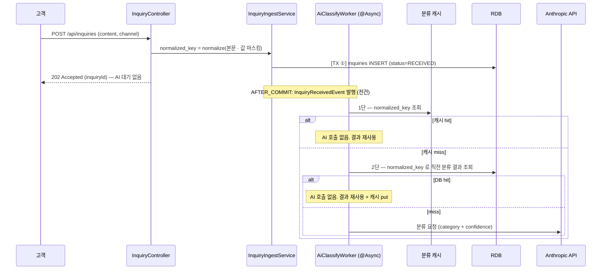
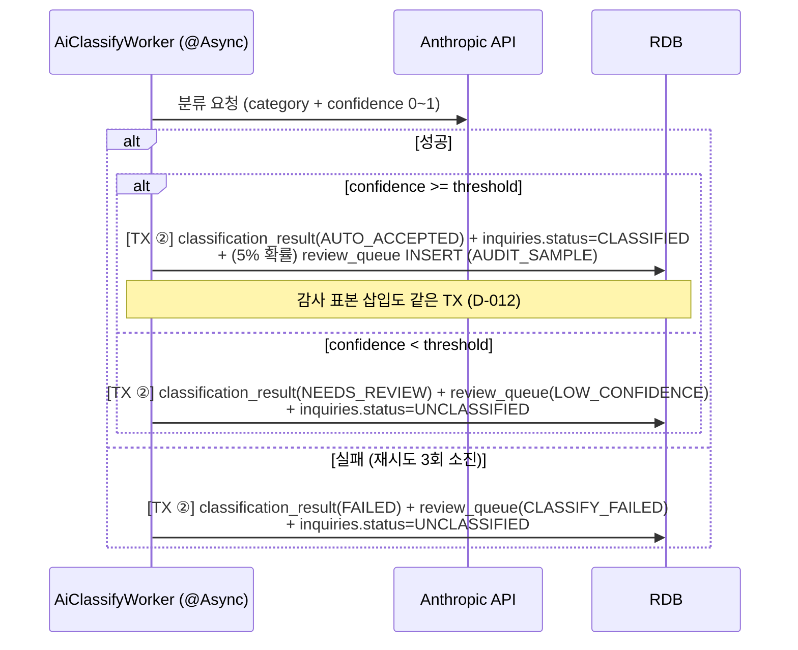
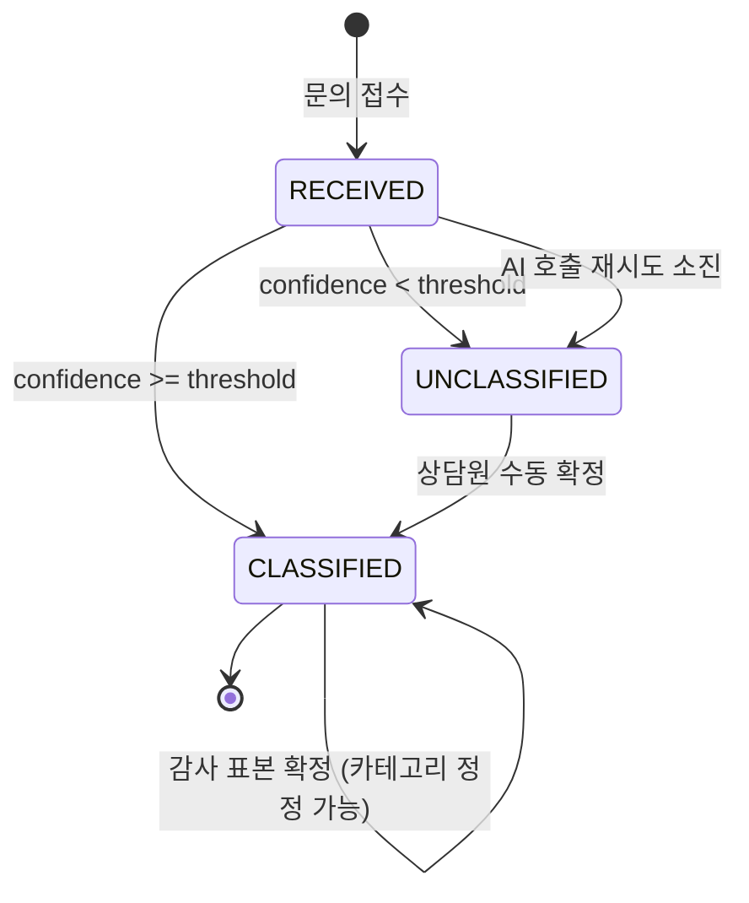

# PRD — AI 문의 분류 검증 파이프라인 (Verifiable Inquiry Triage)

> 기획 단계 (라이프사이클 1단계) 산출물.
> 핵심 질문: **AI가 고객 문의를 자동 분류할 때, 신뢰도가 낮은 결과를 어떻게 감지하고 처리할 것인가?**
> 그리고 한 단계 더: **AI가 "자신 있게" 틀렸을 때는 무엇으로 잡을 것인가?**
> 관련 의사결정: `DECISIONS.md` **D-030 (도메인 전환)**, D-001 (주제 선정 근거), D-020 (단계 책임자), D-003 (기술 스택)
>
> 📖 **모르는 단어가 나오면 [`GLOSSARY.md`](./GLOSSARY.md) 를 보세요.** 처음 읽는다면 용어집의 「0. 5분 요약」부터 읽는 것을 권합니다.
> 각 절 앞의 **「쉽게 말하면」 박스만 읽어도 전체 그림이 잡히도록** 써두었습니다.

## 1. 한 줄 소개

> **쉽게 말하면**: 고객이 문의를 남기면 AI 가 종류를 알아서 분류해줍니다. 그런데 AI 가 틀릴 수 있으니
> ① 확신이 부족한 건 상담원에게 넘기고 ② 확신했던 것도 20건 중 1건은 몰래 뽑아 다시 확인합니다.
> **②가 없으면 "AI 가 확신한다니까 믿는다"가 되어버리는 것** — 이게 이 프로젝트의 출발점입니다.

고객이 카테고리를 고르지 않고 남긴 문의를 AI가 자동 분류하되, **신뢰도가 임계값 미만인 결과는 확정하지 않고 상담원 검토 큐로 격리**하고, **자동 확정된 결과조차 일부를 무작위 감사**해서 오분류가 운영 데이터를 오염시키는 것을 막는 시스템.

AI 결과를 무조건 신뢰하는 파이프라인과의 차이는 두 가지다.

1. AI가 모른다고 말하지 않을 때에도 **"모른다"를 대신 판정한다** (임계값 검증)
2. AI가 안다고 말한 것도 **일부를 표본 검사한다** (감사 샘플링)

2번이 없으면 이 시스템은 결국 *"AI가 스스로 신고한 신뢰도"* 를 무조건 신뢰하는 것과 같다.

> **이 도메인으로 온 경위 (D-030)**: 원래 주제는 에러 분류였고, 같은 에러 1000건을 하나로 묶어 판정하는 **그룹핑**이 설계의 척추였다. CS 문의로 옮기면서 그룹핑을 **포기**했다 — 문의는 개인 건이라 묶으면 각자의 주문·각자의 사정이 사라지기 때문이다(D-027 기준 1 탈락). 대신 **판정은 문의마다 하되 AI 호출만 재사용하는** 2단 절감 경로를 뒀다. 무엇을 잃었는지까지 D-030 에 적어두었다.

## 2. 페르소나

> **쉽게 말하면**: 이 시스템을 쓰는 사람은 셋입니다.
> **문의를 남기는 사람**(고객) / **분류를 확정하는 사람**(상담원) / **전체를 지켜보는 사람**(운영 매니저).
> 셋을 나눈 이유는 **문의를 남기는 쪽이 판정까지 하면 검증이 성립하지 않기** 때문입니다.
> 고객 계정이 털려도 검토 큐와 통계는 못 보게 막혀 있습니다.

| 페르소나 | 권한 | 핵심 행동 | 진입점 |
| --- | --- | --- | --- |
| 고객 (`ROLE_CUSTOMER`) | 문의 접수 + **자기 문의만** 조회 | 카테고리를 고르지 않고 문의를 남기고, 분류를 기다리지 않고 즉시 접수 확인을 받는다 | `POST /api/inquiries` |
| 상담원 (`ROLE_AGENT`) | 검토 큐 조회 + 최종 카테고리 확정 + 문의 조회 | 격리된 문의를 오래된 순으로 확인하고 최종 카테고리를 확정한다 | `GET /api/inquiry-review-queue`, `GET /api/inquiries` |
| 운영 매니저 (`ROLE_MANAGER`) | 상담원 권한 + **전체 통계 + 판정 설정 확인** | AI 분류 성공률·큐 적체·감사 결과를 관찰한다 | `GET /api/stats`, `GET /api/policies` |

> **임계값(`threshold`)과 감사 비율(`sampleRate`)은 Phase 2 에서 조회만 가능하다 (D-028).** 값은 `application.yml` 에 있고 변경은 재기동을 동반한다. 이 둘은 운영 파라미터가 아니라 **측정 조건**이기 때문이다 — 실행 중에 바꿀 수 있으면 측정 8 의 분모가 사후에 복원되지 않는다. 런타임 변경 API 는 Phase 3.

> **권한 경계의 의도**: 문의를 *남기는* 주체 ≠ 분류를 *판정하는* 주체 ≠ 결과를 *관측하는* 주체. 고객 계정이 탈취돼도 검토 큐·통계는 노출되지 않는다.
>
> **감사 샘플링의 blind 조건**: 상담원에게는 해당 항목이 감사 표본인지 노출하지 않는다. 알면 평소보다 신중하게 봐서 감사 결과가 실제 운영 정확도보다 낙관적으로 편향된다.

## 3. User Story

> **쉽게 말하면**: "누가 / 무엇을 하면 / 어떻게 된다"를 13개 문장으로 적은 목록입니다.
> 이 13개가 전부 동작하면 만들어야 할 기능을 다 만든 것입니다.
> 문장 끝 대괄호는 **"이 스토리가 6 필수 기능 중 무엇에 해당하는가"** 를 표시한 것입니다.
> **US-1~9 는 팀이 합의한 원안 번호를 그대로 유지**하고, 10~13 은 설계 과정에서 추가된 것입니다.

### 문의 접수

- **US-1**: (고객)으로서 (문의를 카테고리 선택 없이 남기)면 (AI 분류 완료를 기다리지 않고 즉시 202 응답)을 받을 수 있다. — [비동기]
  - AC: `POST /api/inquiries` 는 AI 분류를 기다리지 않고 즉시 응답한다
  - AC: `inquiries` 에 원문·접수 시각이 저장된다

### AI 자동 분류

- **US-2**: (시스템)으로서 (문의 접수 후 비동기로 AI를 호출)해서 (카테고리 + 0~1 신뢰도)를 받을 수 있다. — [비동기 · AI 보조]
  - AC: `@Async` 로 분류를 호출하고 **문의 저장 트랜잭션과 분리**한다 (접수 응답 지연 방지)
- **US-3**: (시스템)으로서 (AI 호출이 실패하면 최대 3회 재시도)하고 (소진 시 `분류실패` 로 검토 큐에 자동 삽입)할 수 있다. — [비동기 · 재시도]
  - AC: `@Retryable(maxAttempts=3)` + `@Recover` 에서 큐 삽입. **조용히 삼키지 않는다**

### 신뢰도 검증

- **US-4**: (시스템)으로서 (신뢰도가 임계값 이상이면 분류를 자동 확정)할 수 있다. — [핵심 트랜잭션 · AI 보조]
- **US-5**: (시스템)으로서 (신뢰도가 임계값 미만이면 확정하지 않고 검토 큐로 격리)할 수 있다. — [핵심 트랜잭션 · AI 보조]
  - AC(공통): 분류 결과 저장 + 검토 큐 삽입이 **한 트랜잭션 안에서 원자적으로** 처리된다

### 검토·확정

- **US-6**: (상담원)으로서 (검토가 필요한 문의를 오래된 순으로) 조회할 수 있다. — [검색·필터]
  - AC: `GET /api/inquiry-review-queue`, `(status, created_at)` 복합 인덱스로 filesort 없이 정렬
  - 검토 큐에서 **격리 사유·신뢰도·카테고리로는 필터할 수 없다** — 감사 표본 역산이 가능해지므로 (D-010)
- **US-7**: (상담원)으로서 (검토 큐 항목을 열어 최종 카테고리를 확정)해서 (큐 `RESOLVED` + `final_category` 기록 + 문의 상태 전이를 원자적으로) 처리할 수 있다. — [핵심 트랜잭션]
  - AC: `PATCH /api/inquiry-review-queue/{id}`

### 운영 관측

- **US-8**: (운영 매니저)로서 (AI 분류 성공률과 검토 큐 적체 건수)를 (매 조회마다 전수 count 쿼리 없이) 실시간으로 확인할 수 있다. — [캐시 · 권한·역할]
  - AC: Actuator 커스텀 메트릭 + `GET /api/stats` 로 두 지표 노출

### 검증 (비기능)

- **US-9**: (개발자)로서 (분류 결과 저장은 성공했는데 큐 삽입이 실패하는 상황)에서 (**롤백 경계가 트랜잭션 ②에서 끊기는지**) 확인하고 싶다. — [핵심 트랜잭션]
  - AC: 통합 테스트로 강제 실패 주입 → `inquiry_classification_result` 는 **롤백**되고 `inquiries` 원문은 **생존**
  - AC: 이때 해당 문의가 `RECEIVED` 로 방치되므로 `stuckReceived` 지표가 증가하는지 함께 확인
  - ⚠️ **원안은 "`inquiries` 저장까지 롤백되는지 확인"이었으나 D-030 에서 뒤집었다.** US-2 가 이미 접수와 분류를 `@Async` 로 분리했으므로 접수는 그 시점에 커밋이 끝나 있다. 원안대로 롤백되면 **고객이 이미 받은 접수 확인이 거짓말이 된다.**

### 이하 설계 과정에서 추가 (D-030)

- **US-10**: (시스템)으로서 (임계값을 통과해 자동 확정된 문의 중 설정 비율(기본 5%)을 무작위 추출)해서 (`감사표본` 사유로 검토 큐에 삽입)할 수 있다. — [AI 보조]
  - **이 프로젝트의 차별점.** 팀 원안 9개에는 없었으나 성공 기준 2·3 이 이 스토리에 의존한다 (D-030)
- **US-11**: (상담원)으로서 (다른 상담원이 이미 확정한 항목을 중복 확정)하려 할 때 (409 충돌)을 받고, **선행 확정(`ALREADY_RESOLVED`)과 동시 경합(`CONCURRENT_UPDATE`)이 코드로 구분**된다. — [핵심 트랜잭션 · 동시성]
- **US-12**: (시스템)으로서 (같은 정규화 키의 문의가 이미 분류된 적 있으면 AI를 재호출하지 않고 결과를 재사용)할 수 있다. — [캐시]
  - **판정은 문의마다 그대로 한다. 재사용하는 것은 AI 호출뿐이다** (D-030)
- **US-13**: (고객)으로서 (검토 큐·통계 endpoint에 접근)하려 하면 (403 Forbidden)을 받는다. — [권한·역할]

## 4. 핵심 흐름

> **쉽게 말하면**: 문의가 들어와서 → AI 가 분류하고 → 확신이 부족하면 사람에게 넘어가는 **전체 과정**입니다.
> 이 절만 이해하면 시스템의 90% 를 이해한 것입니다.
> 4-1 은 「받는 부분」, 4-2 는 「판단하는 부분」, 4-4 는 「사람이 확정하는 부분」입니다.

### 4-0. 데이터 모델 (3 테이블)

> **쉽게 말하면**: 표 3개를 씁니다. 이전 설계는 5개였는데, 묶음 테이블과 카테고리별 점수표가 빠졌습니다.
>
> | 테이블 | 무엇을 담나 | 한 줄 |
> | --- | --- | --- |
> | `inquiries` | 고객이 남긴 문의 | **판정의 단위.** "분류됐나?" 는 여기에 붙는다 |
> | `inquiry_classification_result` | AI 가 낸 답 + 사람이 고친 답 | 둘 다 남긴다. 덮어쓰면 틀린 증거가 사라진다 |
> | `inquiry_review_queue` | 사람이 봐야 할 목록 | 왜 여기 왔는지(사유)는 상담원에게 안 보여준다 |

```text
inquiries         (id, customer_id, content, channel, normalized_key, status,
                   current_category, current_confidence,
                   received_at, created_at, updated_at)
                  └ 분류의 단위. status: RECEIVED | CLASSIFIED | UNCLASSIFIED
                  └ normalized_key = AI 호출 절감용 조회 키. 판정 단위가 아니다 (D-030)
                  └ current_* = 분류 결과의 역정규화 사본. 목록 조회 조인 제거용 (D-011)

inquiry_classification_result
                  (id, inquiry_id FK, category, confidence, model, raw_response,
                   verdict, final_category, attempt_count, created_at)
                  └ verdict: AUTO_ACCEPTED | NEEDS_REVIEW | FAILED
                  └ category = AI 제안, final_category = 사람 확정 (감사 대조의 핵심 2컬럼)
                  └ model 에 재사용 출처를 남긴다 — 실제 호출과 재사용을 구분 못 하면 측정 6 을 검산할 수 없다

inquiry_review_queue
                  (id, inquiry_id FK, classification_result_id FK, reason, status,
                   agent_id, resolved_at, created_at, version)
                  └ version = 낙관적 락. 동시 확정 시 409 의 근거 (D-021)
                  └ reason: LOW_CONFIDENCE | CLASSIFY_FAILED | AUDIT_SAMPLE
                  └ status: PENDING | RESOLVED
```

임계값은 `classification.threshold` **단일 설정값**이다. 카테고리별 차등(D-006)과 `classification_policy` 테이블은 팀 스코프 조정으로 폐기됐다 — D-030.

`inquiry_classification_result` 에 `category`(AI 제안)와 `final_category`(사람 확정)를 **둘 다 남기는 것**이 감사 측정의 전제다. 사람이 확정할 때 AI 제안을 덮어쓰면 오분류 증거가 사라진다.

**카테고리 10종과 경계 규칙**

> **쉽게 말하면**: 문의를 10칸 중 하나에 넣습니다. 문제는 *"배송이 늦어서 환불해주세요"* 같은 문의가
> 배송인지 환불인지 애매하다는 것입니다. 이런 게 많으면 **상담원 두 명이 서로 다르게 넣게 되고,**
> 그러면 AI 오분류율을 재도 그게 AI 탓인지 사람 탓인지 알 수 없습니다.
> 그래서 **"고객이 요구하는 조치"를 기준으로 넣는다**는 규칙 하나를 먼저 못박습니다.

**분류 기준은 문의의 *원인*이 아니라 고객이 요구하는 *조치*다.** "배송이 늦어서 환불해주세요"는 원인이 배송이어도 요구가 환불이므로 `RETURN_REFUND` 다. 이 규칙 하나가 상호배타성을 만든다.

| 카테고리 | 범위 | 헷갈리는 경계 |
| --- | --- | --- |
| `DELIVERY` | 배송 상태·지연·분실·배송지 변경 | 배송 문제로 **환불**을 요구하면 `RETURN_REFUND` |
| `RETURN_REFUND` | 반품·교환·환불 요청과 그 진행 상황 | 발송 **전** 취소는 `ORDER_CHANGE` |
| `PAYMENT` | 결제 수단·결제 실패·중복 청구·영수증 | 환불 **금액**에 대한 이의는 `RETURN_REFUND` |
| `PRODUCT` | 상품 사양·재고·호환성 (주로 구매 **전**) | 받은 상품의 하자는 `RETURN_REFUND` |
| `ACCOUNT` | 로그인·비밀번호·회원정보·탈퇴 | 결제 수단 등록 실패는 `PAYMENT` |
| `ORDER_CHANGE` | 발송 **전** 주문 내용 변경·취소 | 발송 **후**면 `RETURN_REFUND` |
| `PROMOTION` | 쿠폰·적립금·할인·이벤트 | 쿠폰 적용된 금액의 결제 실패는 `PAYMENT` |
| `SERVICE_USAGE` | 앱/웹 사용법·기능 문의 (상품이 아닌 서비스) | 상품 사용법은 `PRODUCT` |
| `COMPLAINT` | 구체적 조치 요구 **없이** 불만·항의만 있는 경우 | 조치 요구가 있으면 그 조치의 카테고리로 |
| `ETC` | 위 9종 어디에도 해당하지 않음 | 판단이 어려워서 고르는 칸이 **아니다** |

> ⚠️ **`ETC` 남용은 측정 1·8 을 무너뜨린다.** "애매하니까 `ETC`" 는 금지다 — 정답 레이블을 만들 때 `ETC` 비율이 10%를 넘으면 경계 정의가 실패한 것이므로 카테고리 정의부터 고친다.
> 이 경계표는 **D-027 기준 2(정답 단일성)를 통과하기 위한 조건**이다. 측정 12(검토자 간 일치도)가 낮게 나오면 여기부터 다시 조인다.

### 4-1. 접수 → AI 호출 절감 (2단 경로)

> **쉽게 말하면**: 문의를 받으면 **AI 를 기다리지 않고 바로 접수 확인**을 돌려줍니다. AI 가 3초 걸려도
> 고객은 즉시 답을 받습니다. 분류는 뒤에서 따로 돌아갑니다.
>
> 그리고 **똑같은 내용의 문의가 또 오면 AI 를 다시 부르지 않습니다.** 이전에 받은 답을 재사용합니다.
> 단 **판정은 문의마다 따로 남깁니다** — 문의를 묶어버리면 각자의 주문·각자의 사정이 사라지니까요.



**설계 의도**

1. `POST /api/inquiries` 응답은 AI 호출과 **완전히 디커플링**된다. AI가 수 초 걸려도 고객 응답시간에 영향이 없다.
2. **2단을 두는 이유** — 캐시만 두면 Redis 재시작 시 절감이 0 으로 리셋되고, `hit rate` 와 `절감률` 이 같은 값이 되어 D-014 가 무의미해진다. DB fallback 이 있어야 두 지표가 분리된다 (D-030):
   - AI 절감률 = `1 - (AI 호출 수 / 투입 건수)`
   - 캐시 hit rate = `hit / (hit + miss)` — **항상 절감률 이하**. 캐시 miss 여도 DB 에 있으면 AI 는 안 부른다
3. **같은 키의 동시 유입은 AI 를 중복 호출할 수 있고, 이를 락으로 막지 않는다.** 막으려면 키 단위 직렬화가 필요한데 접수 경로를 느리게 만들고 그룹핑으로 되돌아가는 길이다. 중복 호출은 절감률을 조금 떨어뜨릴 뿐 정확성을 해치지 않는다 — 측정 6 에서 이 손실분을 함께 기록한다.
4. **정규화 강도가 이 설계의 급소다.** 약하면 hit rate 가 0 에 수렴해 절감이 사라지고, 세면 서로 다른 문의가 한 키로 병합돼(**과도 병합**) 잘못된 분류가 조용히 퍼진다. **과도 병합이 더 위험하므로** 정규화를 조일 때는 항상 그쪽을 먼저 확인한다.
5. 문의 본문은 고객이 쓴 자연어라 **개인정보가 섞여 들어온다.** AI 로 보내기 전 정규화 단계의 마스킹(주문번호·연락처·금액·날짜)을 거친다.

### 4-2. AI 분류 → 검증 → 판정 (핵심 구간)

> **쉽게 말하면**: AI 가 "이건 환불 문의고 확신도 0.85" 라고 답하면 **합격 점수와 비교**합니다.
>
> - 점수가 **높으면** → 자동 확정. 단 **20건 중 1건은 몰래 뽑아** 상담원에게도 보냅니다 (감사)
> - 점수가 **낮으면** → 상담원에게 넘김
> - AI 응답이 **깨졌으면** → 3번 다시 시도하고, 그래도 안 되면 상담원에게 넘김
>
> 세 갈래 모두 **"결과 저장 + 큐에 넣기"가 한 덩어리로 처리**됩니다. 하나만 성공하면
> **아무도 모르게 사라진 문의**가 생기는데, 그게 이 시스템이 막으려는 바로 그 문제입니다.



**분기별 트랜잭션 원자성이 왜 중요한가**

`NEEDS_REVIEW` / `FAILED` 분기에서 *"분류 결과는 저장됐는데 검토 큐 삽입이 실패"* 한 상태는 존재할 수 없어야 한다. 그 상태가 곧 **조용히 유실된 미분류 문의** — 이 시스템이 막으려는 바로 그 실패다.

**단, 롤백 경계는 ②에서 끊긴다 (US-9 · D-030).** ①(문의 저장)은 이미 커밋됐으므로 ②가 실패해도 **롤백되지 않는다.** 고객이 받은 접수 확인을 되돌릴 수는 없기 때문이다.

**감사 표본 삽입도 같은 트랜잭션에 넣는다 (D-012).** 표본이 소리 없이 누락되면 실제 감사율이 5% 미달이 되고, **§8 측정 8(자동 확정 건 오분류율)의 분모가 조용히 줄어든다.** 측정 무결성이 이 프로젝트의 주제인데 측정 장치 자체를 best-effort 로 두는 셈이다. "부차적이니 분리한다"는 직관은 **외부 의존성**에 적용되는 것이고, 여기 두 쓰기는 같은 DB·같은 커넥션이라 분리해서 얻는 격리 이득이 없다.

**롤백된 문의의 복구 경로가 Phase 2 에는 없다 (D-017).** ②가 롤백되면 문의는 `RECEIVED` 로 남는데, `InquiryReceivedEvent` 는 이미 소비됐고 자동 재분류는 Phase 3 이므로 **아무도 다시 분류하지 않는다.** Phase 2 에서는 고치는 대신 **관찰 가능하게** 만든다:

- `GET /api/stats` 의 `classification.stuckReceived` — 접수 후 N분(기본 10분) 이상 `RECEIVED` 에 머무른 문의 수
- Actuator gauge `triage.inquiries.stuck_received`
- 이 값이 0 이 아니면 분류 파이프라인이 조용히 실패하고 있다는 신호다

추가 안전장치로 **감사율 자체를 검증 가능하게** 만든다 — `GET /api/stats` 가 표본 수(`sampledTotal`)와 모집단 수(`eligibleTotal`), 실측 비율(`actualSampleRate`)을 함께 노출한다. 설정값 5% 와 실측값이 벌어지면 즉시 드러난다.

### 4-3. 문의 상태 전이

> **쉽게 말하면**: 문의는 상태가 셋뿐입니다.
> **RECEIVED**(접수됨) → **CLASSIFIED**(분류 끝) 또는 **UNCLASSIFIED**(사람이 봐야 함).
>
> 여기서 딱 하나만 기억하면 됩니다 — **"사람이 봐야 함" 에서 "분류 끝" 으로 가는 건 오직 사람뿐입니다.**
> AI 에게는 이 권한이 없습니다. AI 가 자기가 격리한 걸 자기가 풀 수 있으면 검증이 아니니까요.



`UNCLASSIFIED → CLASSIFIED` 전이는 **오직 사람만** 일으킬 수 있다. AI는 이 전이 권한이 없다.
`CLASSIFIED → CLASSIFIED` 자기 전이는 감사 표본 경로다 — 이미 자동 확정된 문의의 카테고리를 사람이 정정할 수 있고, 이때 `category ≠ final_category`가 되어 **오분류 1건이 기록된다.**

> `RECEIVED` 에 머물러 있는 것은 **정상(분류 대기)일 수도 있고 유실(②롤백)일 수도 있다.** 둘을 시간으로 가른 것이 `stuckReceived` 다.

### 4-4. 검토 큐 처리 흐름

> **쉽게 말하면**: 상담원이 목록을 열고 → 카테고리를 확정하면 → 끝입니다.
>
> 다만 목록에 **"이게 왜 여기 있는지"(사유)와 AI 확신 점수는 안 보여줍니다.**
> 감사로 뽑힌 건은 "점수가 합격선 이상"인 것들이라, 점수와 합격선을 둘 다 보여주면
> **뺄셈 한 번으로 감사 표본을 전부 골라낼 수 있기** 때문입니다. 그러면 상담원이 그 건만 신중히 보게 되어
> 감사 결과가 실제보다 좋게 나옵니다.

```text
상담원 로그인
  → GET /api/inquiry-review-queue?status=PENDING (오래된 순, 페이징)
     · reason / confidence / threshold 를 응답에 포함하지 않는다 → 감사 표본 blind 유지
       (AUDIT_SAMPLE 은 정의상 confidence >= threshold 이므로 두 값만 주면 역산 가능, D-010)
     · AI 제안 카테고리 + 문의 본문만 표시
  → PATCH /api/inquiry-review-queue/{id} {"finalCategory": "RETURN_REFUND"}
  → [TX ③] 큐 항목 상태 검사 + 낙관적 락 → status=RESOLVED
        + classification_result.final_category 기록
        + inquiries.status=CLASSIFIED
  → 커밋 후 분류 캐시 갱신 + 적체 통계 캐시 evict
```

## 5. 비기능 요구사항

> **쉽게 말하면**: "무엇을 만드나"가 아니라 **"얼마나 빠르고 안전해야 하나"** 를 적은 표입니다.
> 여기 숫자는 전부 **목표치일 뿐 아직 잰 값이 아닙니다.** 실제 수치는 코드가 돌아간 뒤
> 직접 부하를 줘서 재고, **AI 가 추정한 숫자는 근거로 쓰지 않습니다.**
> `p95 < 100ms` 는 "요청 100건 중 95건은 0.1초 안에 끝난다"는 뜻입니다 (용어집 참조).

| 항목 | 목표 | 측정 방법 |
| --- | --- | --- |
| 사용자 규모 | 문의 접수 50 req/s, 동시 상담원 5명 | 부하 도구 실측 (아래) |
| `POST /api/inquiries` 응답시간 | p95 < 100ms (AI 호출 비동기 분리 전제) | `hey -n 2000 -c 50` **본인 실측만** |
| `GET /api/inquiry-review-queue` 응답시간 | p95 < 200ms (10만 건 적체 기준) | 인덱스 전/후 `EXPLAIN` + `hey` 비교 |
| **AI 호출 절감률** (2단 경로 효과) | 반복 포함 1000건 투입 시 절감률을 **수치로 산출**. 목표치는 정규화 규칙 확정 후 세운다 | 호출 카운터 메트릭 실측 |
| **분류 캐시 hit rate** | 절감률과 **다른 지표** — 캐시 miss 여도 DB 에 있으면 AI 는 안 부른다 (D-014) | Actuator 캐시 메트릭 |
| 데이터 정합성 | 분류 결과 저장 ↔ 큐 삽입 all-or-nothing. **단 문의 원문(①)은 ② 실패와 무관하게 생존.** 동시 확정 시 last-write-wins 금지 | 롤백 통합 테스트 + 동시 `PATCH` 테스트 |
| AI 신뢰성 | 신뢰도 0.8 이상 구간 분류 일치율 ≥ 90% | 정답 레이블 50건 대조 |
| **감사 유효성** | 자동 확정 건의 오분류율을 수치로 산출 가능. 단 앵커링 편향으로 **하한값** | 감사 표본 `category` vs `final_category` 대조 |
| **blind 무결성** | 검토 큐 응답만으로 감사 표본을 역산할 수 없어야 함 | 응답 필드 전수 점검 + 역산 가능성 리뷰 |
| 개인정보 | 문의 본문은 AI 전송 전 마스킹을 거친다 | 마스킹 단위 테스트 |
| 보안 | 역할 기반 인가. Anthropic API key는 환경변수만 (`.env` commit 금지) | 403 케이스 E2E |

> ⚠️ **AI 호출 절감률에 목표 수치를 미리 적지 않았다.** 이전 도메인에서는 "1000건 → 50회 이하(95% 절감)"였는데, 그건 **그룹핑이 있을 때의 숫자**였다. 자연어 문의의 정규화 키가 실제로 얼마나 겹치는지는 재보기 전에는 알 수 없고, 여기에 추측 수치를 적는 것은 `CLAUDE.md` AI 검증 규칙 위반이다. **측정 6 이 먼저고 목표치는 그다음이다.**
>
> `CLAUDE.md` AI 검증 규칙에 따라 **응답시간·throughput 수치는 AI 추정값을 evidence로 쓰지 않는다.**

## 6. 6 공통 필수 기능 매핑

> **쉽게 말하면**: 과제에서 **"이 6가지는 반드시 넣어라"** 고 한 기능들을,
> 우리 시스템의 어느 부분이 담당하는지 짝지어 놓은 표입니다.
> 예를 들어 「비동기」는 "과제라서 넣은" 게 아니라, AI 가 느려서 안 넣으면 접수가 막히기 때문입니다.

| 공통 기능 | 본 시스템 매핑 | 담당자 |
| --- | --- | --- |
| 권한·역할 | `ROLE_CUSTOMER` / `ROLE_AGENT` / `ROLE_MANAGER` 3역할 + `@PreAuthorize`. 접수 주체 · 판정 주체 · 관측 주체 분리 | 김준현 (P2 선작업) |
| 핵심 트랜잭션 | ① `InquiryIngestService.receive` — 문의 저장 (②와 분리 유지)<br>② `ClassificationService.verifyAndPersist` — 분류 결과 저장 + 문의 상태 전이 + 조건부 큐 삽입<br>③ `ReviewService.confirm` — 큐 상태 검사 + 확정 + 최종 카테고리 기록 + 문의 전이 | ① 이용택 (P1)<br>② 김준현 (P2)<br>③ 김은빈 (P3) |
| 검색·필터 | `InquiryReviewQueueRepository.search` — **status / 기간** 필터 + `(status, created_at)` 인덱스 (사유·신뢰도·카테고리 필터는 blind 규칙상 제공 안 함, D-010). `inquiries` 는 status / category 필터 + `received_at` 정렬 | 김은빈 (P3) |
| 캐시 | ① `normalized_key → 분류 결과` 캐시 — **AI 호출 절감 경로의 1단**. 2단(DB)과 함께 hit rate ≤ 절감률을 성립시킨다 (D-014, D-030)<br>② 큐 적체·감사 요약 통계 `@Cacheable` (TTL 10s) + `@CacheEvict(allEntries=true)`. Actuator gauge가 매 스크랩마다 전수 count 치는 것 방지 | ① 이용택 (P1, 계약 C)<br>② 김은빈 (P3) |
| 비동기·이벤트 | `InquiryReceivedEvent` (Spring Events) → `@Async` AI 분류 워커 + `@Retryable(maxAttempts=3)` + `@Recover`로 큐 자동 삽입 | 이용택 발행 (P1) → 김준현 수신 (P2) |
| AI 보조 | `AiClassificationService` — 문의 → 카테고리 + 신뢰도<br>**+ 임계값 검증 계층**<br>**+ 자동 확정 건 무작위 감사 샘플링** (본 프로젝트의 차별점) | 김준현 (P2) |

> `@Transactional` 위치는 `CLAUDE.md` 규칙 준수 — Controller 금지, 단일 read 금지, 위 3개 묶음 read+write 메서드에만. 캐시 evict/갱신은 **커밋 후**에 수행한다.

## 7. 제약 사항

> **쉽게 말하면**: **이번에 만들 것 / 나중으로 미룰 것 / 미리 알고 있는 위험**을 적었습니다.
> 특히 마지막 「알려진 리스크」 표가 중요합니다 — **"이 설계는 이런 점이 약하다"를 미리 적어둔 것**이라,
> 나중에 문제가 터졌을 때 "몰랐다"가 아니라 "알고 감수했다"가 됩니다.

### Phase 2 (Week 9 · 5일) 범위

- 문의 접수 API + **3개 테이블** (`inquiries`, `inquiry_classification_result`, `inquiry_review_queue`) JPA 매핑
- **스키마는 Flyway 로 관리** — `ddl-auto: validate` + `V1__init_schema.sql` (D-023). 후보 인덱스 V2 분리는 D-030 으로 폐기
- **엔티티 생성은 정적 팩토리로만** — 계약 B·C 와 D-022(파싱 실패 시 `category`·`confidence` 동시 null)를 컴파일러가 강제하게 한다. Lombok 미도입 (D-025)
- **정규화 키 + 2단 절감 경로** — 판정은 문의마다, AI 호출만 재사용 (D-030)
- AI 분류 + **임계값 검증 + 검토 큐 격리** (프로젝트 핵심 — 절대 뒤로 밀지 않음)
- **감사 샘플링** — 자동 확정 건 5% 무작위 격리 + `category` vs `final_category` 대조
- `@Transactional` 원자성 + 롤백 시나리오 테스트 (**①생존 / ②롤백**)
- `@Async` + `@Retryable` 3회 + 소진 시 큐 자동 삽입
- 검토 큐 복합 필터 조회 + 수동 확정 API + `(status, created_at)` 인덱스

### Phase 3 이후로 미루는 항목

| 항목 | 내용 | 미루는 이유 |
| --- | --- | --- |
| A | **동일 이슈 문의 그룹핑(`topic_key`)** | 팀 스코프 밖. 도입하려면 D-027 기준 1 을 먼저 통과시켜야 한다 (D-030) |
| B | **카테고리별 개별 임계값 정책 테이블** | 팀 스코프 밖. D-006 폐기와 함께 이월 |
| C | **관리자용 임계값 변경 API** | 지금은 config 고정. 측정 조건을 실행 중에 바꾸면 분모를 신뢰할 수 없다 (D-028) |
| D | JWT 실인증 | Phase 2 는 헤더 stub |
| E | 재분류 스윕 (`stuckReceived` 자동 복구) | 관찰까지가 Phase 2. 재시도 소진 복구와 같은 문제라 함께 처리하는 것이 맞다 (D-017) |
| F | AI 장애 시 백오프·circuit breaker | 재시도 3회까지가 Phase 2 |
| G | 감사 비율 런타임 조정 + 변경 이력 | D-028 재평가 조건 충족 시 |

### 알려진 리스크와 대응

| 리스크 | 대응 |
| --- | --- |
| **정규화 키 hit rate 가 0 에 수렴** — 자연어 문의는 완전일치가 드물다 | **이 설계의 최대 리스크 (D-030 재평가 조항).** 측정 6 에서 절감률이 유의미하지 않으면 정규화 규칙을 조이고, 그래도 안 되면 캐시 지점을 검토 큐 목록 조회로 옮기는 것을 후속 항목으로 검토 |
| **과도 병합** — 정규화를 세게 하면 다른 문의가 한 키로 묶여 잘못된 분류가 재사용됨 | 과도/과소 병합을 **양쪽 다** 테스트 케이스로. 과도 병합을 더 위험한 것으로 다룬다 |
| **카테고리 경계 모호로 정답이 흔들림** | §4-0 경계표 + "원인이 아니라 조치" 규칙. 측정 12(검토자 간 일치도)로 검증하고 낮으면 경계 정의부터 고친다 |
| **동시성 학습 자산 축소** — 3분할 중 2개가 D-030 으로 소멸 | 낙관적 락 + 409 2종(D-021)에 집중. 감추지 않고 D-030 에 손실로 기록 |
| ②롤백으로 문의가 `RECEIVED` 로 영구 방치 | Phase 2는 **관찰까지만** — `stuckReceived` + Actuator gauge 로 조용한 유실을 드러낸다. **측정 3 시 실제로 증가하는지 함께 확인** (D-017) |
| AI API 장기 장애 시 전건 수동 처리 대상화 | Phase 2에서는 한계로 명시만 (재시도 3회 소진 → 큐). 백오프·circuit breaker는 Phase 3 (F) |
| 문의 본문에 개인정보 유입 | 정규화 단계 마스킹 후 AI 전송. 마스킹 단위 테스트 필수 |
| 검토 큐 적체 시 수동 처리 부담 | MVP는 수동 확정 API만. 적체를 메트릭으로 노출해 **적체 자체를 관찰 가능하게** 만드는 것까지가 Phase 2 목표 |
| **로컬 통합 테스트가 Docker Desktop 버전에 의존** | 팀 전원 Docker Desktop **4.44.2(build 202017) 이하 + 자동 업데이트 해제** (D-026) |

## 8. 성공 지표 (Phase 2 종료 시점)

### 미션 통과 조건

- [ ] 6 공통 필수 기능 모두 구현 (§6 표 전체)
- [ ] 라이프사이클 5 단계 모두 산출물 1개 이상 (`LIFECYCLE-COVERAGE.md`)
- [ ] 8 PR 이상 머지 + 모두 team-pr-guard / AI Review CI green
- [ ] 핵심 흐름 시연 1사이클: **신뢰도 낮은 문의 투입 → 자동 격리 → 상담원 확정**
- [ ] 차별 흐름 시연 1사이클: **자동 확정된 문의가 감사 표본으로 뽑혀 → 사람이 카테고리 정정 → 오분류 1건으로 집계**

### 도메인 측정 지표 (본인 실측만 기록)

> 번호는 `LIFECYCLE-COVERAGE.md` 책임자 표와 **1:1 로 일치**시킨다. D-030 으로 이전 판의 5ⓔ·7ⓐ·9 가 삭제됐고, **남은 번호는 바꾸지 않았다** — 번호를 당기면 `evidence/` 와 커밋 이력의 참조가 전부 어긋나기 때문이다.

| # | 측정 | 방법 | 기록 위치 |
| --- | --- | --- | --- |
| 1 | AI 분류 일치율 | 카테고리 10종 × 5건 = 50건 투입, 신뢰도 구간별(0~0.5 / 0.5~0.8 / 0.8~1.0) 정답 대조 | `evidence/` 비교 표 |
| 2 | 검토 큐 적체율 | 50건 투입 후 사유별(`LOW_CONFIDENCE` / `CLASSIFY_FAILED` / `AUDIT_SAMPLE`) 삽입 건수 / 전체 비율 | `evidence/` |
| 3 | **트랜잭션 롤백 경계 검증** | 큐 삽입 강제 실패 주입 → `inquiry_classification_result` **롤백** + `inquiries` **생존** 동시 확인 + `stuckReceived` 증가 확인 (D-030 의 US-9 재정의) | 통합 테스트 |
| 4 | 재시도 동작 | AI API 오류 주입 → 재시도 횟수·간격 로그 + 최종 큐 삽입 확인 | 구조화 로그 |
| 5 | 인덱스 효과 (조회) | `EXPLAIN` 비교 — ⓐ 검토 큐 `(status, created_at)` 전/후<br>ⓑ `normalized_key` 조회 인덱스 전/후<br>ⓒ `GET /api/inquiries` status + 기간 + category | `evidence/` |
| 6 | **AI 호출 절감률** | 반복 포함 1000건 투입 → 실제 AI 호출 횟수. **절감률 = 1 - (AI 호출/투입)** 으로만 정의한다. 캐시 hit rate 로 대체하지 않는다 (D-014). **동시 유입에 의한 중복 호출분을 함께 기록** (D-030) | `evidence/` |
| 7ⓑ | **동시 확정 경합** | 같은 큐 항목 2 스레드 동시 `PATCH` → 409 발생 및 `code` 분포 기록. **`CONCURRENT_UPDATE` 가 0 이면 경합 창이 재현되지 않은 것이므로 테스트가 무의미하다는 신호** (D-021) | 동시성 테스트 |
| 8 | **자동 확정 건 오분류율** | 감사 표본에서 `category ≠ final_category` 비율. 신뢰도 구간별로 분해. 편향원 **두 개를 분리해 보고**한다 — ⓐ **앵커링**으로 하한값 (D-010), ⓑ **검토자 불일치**는 측정 12 로 보정 | `evidence/` |
| 10 | **blind 무결성** | 검토 큐 응답 필드 전수 점검. **결정적 역산**(필드 조합으로 100% 식별)은 0건이어야 하며 발견 시 필드 제거. **확률적 추론**(본문으로 짐작)은 제거 불가하므로 목록화만 (D-019) | 리뷰 메모 |
| 11 | **캐시 hit rate** | 측정 6과 **별개 지표**. 같은 1000건 투입에서 hit/miss 카운터 기록 후 절감률과의 격차를 확인 — 격차 = "캐시 miss 지만 DB 에 이전 결과 존재" 비율 (D-014) | `evidence/` |
| 12 | **검토자 간 일치도** | 같은 표본 20건을 상담원 2명이 **서로 모르게 독립 분류** → 일치율 산출. 측정 8 의 오분류율에서 **검토자 불일치분을 분리**하는 대조군이다. 불일치가 잦은 카테고리 쌍(예: `DELIVERY` ↔ `RETURN_REFUND`)을 함께 기록해 §4-0 경계표를 조일 근거로 쓴다 | `evidence/` |

**§5 비기능 측정** — 목표치는 §5, 수치는 본인 `hey` 실측만

| 측정 | 내용 |
| --- | --- |
| §5-a | `POST /api/inquiries` p95 < 100ms (AI 지연 비전파 확인) |
| §5-b | `GET /api/inquiry-review-queue` p95 < 200ms + **N+1 제거 전후 쿼리 수** |

### 이 프로젝트의 성공 기준 세 줄

1. AI가 틀렸을 때 시스템이 **조용히 틀리지 않고, 큐에 쌓이며 관찰 가능하게 틀리는가.**
2. AI가 **자신 있게** 틀렸을 때, 그 사실을 **수치로 말할 수 있는가.**
3. 그 수치가 **어느 방향으로 얼마나 편향됐는지**까지 말할 수 있는가 (하한값 해석).

## 9. 출처 · 참고

- 원 설계는 [NAVER D2 · SaaS 대체하기: AI와 함께한 광고SDK 에러 모니터링 시스템 구축기](https://d2.naver.com/helloworld/8319114) 를 백엔드 검증 파이프라인 관점으로 축소·재해석한 것이었다. 도메인은 D-030 으로 CS 문의로 옮겼고, **검증 파이프라인 구조는 그대로 승계**했다.
